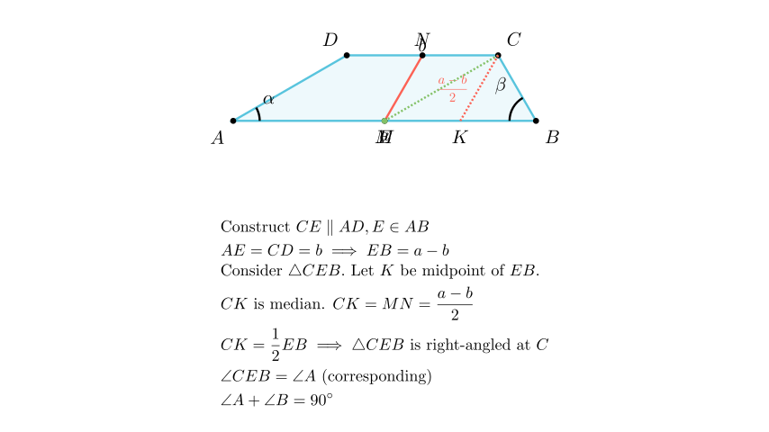

# Агли на основа во специфичен трапез

## Текст на задачата
Даден е трапез $ABCD$ со основи $AB=a, CD=b, a>b$. Нека $M$ и $N$ се средини на основите $AB$ и $CD$, соодветно, и нека $MN = \frac{a-b}{2}$. Пресметај го збирот на аглите на поголемата основа.

## 📐 Скица / Конструкција

## 💡 Решение

Нека $E$ е точка на основата $AB$ таква што $CE \parallel AD$. Тогаш четириаголникот $AECD$ е паралелограм, па $AE = CD = b$ и $CE = AD$.
Должината на отсечката $EB$ е $AB - AE = a - b$.

Да го разгледаме триаголникот $CEB$. Нека $K$ е средина на страната $EB$.
Отсечката $MN$ ги поврзува средините на основите на трапезот. Познато е дека отсечката што ги поврзува средините на основите е еднаква на половина од разликата на основите ако и само ако збирот на аглите на поголемата основа е $90^\circ$.

Попрецизно, ако го транслираме кракот $AD$ за вектор $\vec{DC}$, добиваме отсечка $CE$.
Векторот $\vec{MN} = \frac{1}{2}(\vec{AD} + \vec{BC})$.
Во триаголникот $CEB$, страните се $CE$ (паралелна и еднаква на $AD$), $CB$, и $EB$ (со должина $a-b$).
Медијаната $CK$ во $\triangle CEB$ (каде $K$ е средина на $EB$) е еднаква на $MN$.
Ова може да се види векторски: $\vec{CK} = \frac{1}{2}(\vec{CE} + \vec{CB})$.
Бидејќи $\vec{CE} = \vec{AD}$, имаме $\vec{CK} = \frac{1}{2}(\vec{AD} + \vec{CB}) = \vec{MN}$.

Должината на медијаната $CK$ е дадена со $MN = \frac{a-b}{2}$.
Бидејќи $EB = a-b$, следува дека $CK = \frac{1}{2} EB$.
Во триаголник, медијаната кон една страна е половина од таа страна ако и само ако триаголникот е правоаголен, со прав агол во темето од кое поаѓа медијаната.
Значи, $\triangle CEB$ е правоаголен со прав агол во $C$, т.е. $\angle ECB = 90^\circ$.

Бидејќи $CE \parallel AD$, имаме $\angle CEB = \angle DAB = \alpha$ (согласни агли).
Во $\triangle CEB$, збирот на аглите е $180^\circ$: $\angle CEB + \angle CBE + \angle ECB = 180^\circ$.
$\alpha + \beta + 90^\circ = 180^\circ$.
$\alpha + \beta = 90^\circ$.

Збирот на аглите на поголемата основа е $90^\circ$. 
3. Бидејќи $M$ е средина на $AB$, таа е и средина на $PQ$, па $PM = MQ = \frac{a-b}{2}$. 
4. Во $\triangle PNQ$, $NM$ е медијана и $NM = \frac{a-b}{2}$, што значи $NM = \frac{1}{2}PQ$. 
5. Ова својство важи само за правоаголен триаголник, па $\angle PNQ = 90^\circ$. 
6. Збирот на аглите на основата е $180 - 90 = 90^\circ$.

## ⚠️ Аналитички пристап (само ако е неизбежен)
<Ако мора да се користат координати, објасни зошто синтетичкиот пат е претежок.>

## 🏁 Заклучок
Видете го решението погоре.