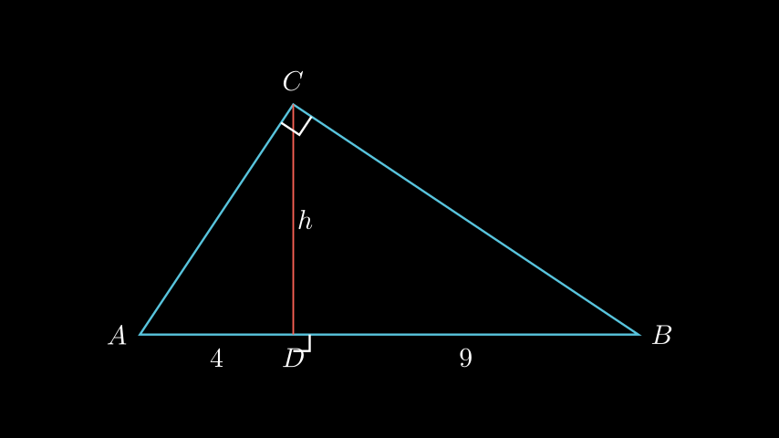

# Висина кон хипотенузата

## Текст на задачата
Во правоаголен триаголник $ABC$ ($\angle C = 90^\circ$), висината $CD$ спуштена кон хипотенузата ја дели на отсечки со должини $AD=4$ cm и $BD=9$ cm. Пресметај ја должината на висината $CD$.

## 📐 Скица / Конструкција

## 💡 Решение

Дадено е:
*   Правоаголен триаголник $ABC$ со прав агол во $C$.
*   Висина $CD \perp AB$.
*   Отсечки $AD = 4$ cm и $BD = 9$ cm.

Според Евклидовата теорема за висината во правоаголен триаголник, квадратот на висината е еднаков на производот од отсечките на хипотенузата:
$$ CD^2 = AD \cdot BD $$

Заменуваме со дадените вредности:
$$ CD^2 = 4 \cdot 9 $$
$$ CD^2 = 36 $$

Коренуваме за да ја добиеме должината:
$$ CD = \sqrt{36} $$
$$ CD = 6 \text{ cm} $$

Висината $CD$ изнесува $6$ cm.