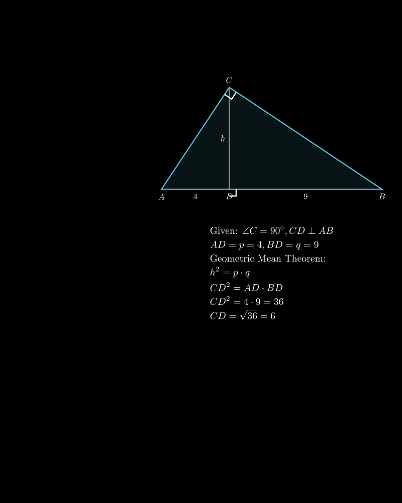

# Висина кон хипотенузата

## Текст на задачата
Во правоаголен триаголник $ABC$ ($\angle C = 90^\circ$), висината $CD$ спуштена кон хипотенузата ја дели на отсечки со должини $AD=4$ cm и $BD=9$ cm. Пресметај ја должината на висината $CD$.

## 📐 Скица / Конструкција

{ width=500 }

## 🧠 Анализа
**Зошто е оваа задача тешка?**
Треба да се препознае примената на Евклидовите теореми за правоаголен триаголник. Конкретно, теоремата за висината спуштена кон хипотенузата.

**Конструктивен потег:**
Искористи ја формулата $h^2 = p \cdot q$, каде $h$ е висината, а $p$ и $q$ се проекциите на катетите врз хипотенузата (отсечките на кои висината ја дели хипотенузата).

## 💡 Решение
Дадено е:
*   Правоаголен триаголник $ABC$ со прав агол во $C$.
*   Висина $CD \perp AB$.
*   Отсечки $AD = 4$ cm и $BD = 9$ cm.

Според Евклидовата теорема за висината во правоаголен триаголник, квадратот на висината е еднаков на производот од отсечките на хипотенузата:
$$ CD^2 = AD \cdot BD $$

Заменуваме со дадените вредности:
$$ CD^2 = 4 \cdot 9 $$
$$ CD^2 = 36 $$

Коренуваме за да ја добиеме должината:
$$ CD = \sqrt{36} $$
$$ CD = 6 \text{ cm} $$

Висината $CD$ изнесува $6$ cm.
{ width=500 }

{ width=500 }
## 🧠 Анализа
Користи ја Евклидовата теорема за висината во правоаголен триаголник: Висината на квадрат е еднаква на производот на проекциите на катетите ($h^2 = p \cdot q$).

## 📝 Решение (СИНТЕТИЧКО)
Дадено е:
- $p = AD = 4$ cm
- $q = BD = 9$ cm

Според метричките релации во правоаголен триаголник, важи:
$$ CD^2 = AD \cdot BD $$

Заменуваме со броевите:
$$ CD^2 = 4 \cdot 9 $$
$$ CD^2 = 36 $$
$$ CD = \sqrt{36} = 6 $$

**Резултат:** Висината е **6 cm**.

## ⚠️ Аналитички пристап (само ако е неизбежен)
<Ако мора да се користат координати, објасни зошто синтетичкиот пат е претежок.>

## 🏁 Заклучок
Видете го решението погоре.