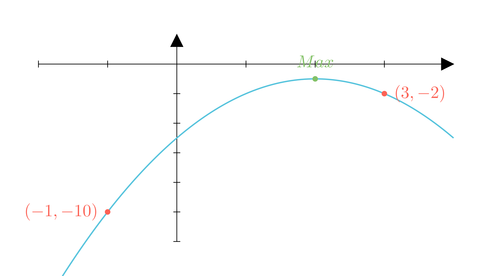

[⬅️ Назад кон Индексот](../../README.md) | [🧰 Skill: logic](../../../tools/skill_guides/logic.md)

# Најмала вредност на функција

## 📝 Текст на задачата
Најмалата вредност на функцијата $y = 4x - x^2 - 5$ на интервалот $[-1; 3]$ е еднаква на...

## 📐 Скица

  

## 🧠 Анализа
**Зошто е оваа задача тешка?**
Графикот е парабола свртена надолу ($a=-1$). Темето е максимум. Најмалата вредност на даден интервал мора да биде или во темето (ако е минимум) или во една од крајните точки на интервалот. Бидејќи овде темето е максимум, минимумот е сигурно на еден од краевите.

**Конструктивен потег:**
Графикот е парабола свртена надолу ($a=-1$). Темето е максимум. Најмалата вредност на даден интервал мора да биде или во темето (ако е минимум) или во една од крајните точки на интервалот. Бидејќи овде темето е максимум, минимумот е сигурно на еден од краевите.

## 💡 Решение

??? tip "Чекор 1: Наоѓање на темето"
    Апсцисата на темето е $x_v = -\frac{b}{2a} = -\frac{4}{-2} = 2$.
    Бидејќи $a < 0$, ова е точка на **максимум**. $x=2$ припаѓа на интервалот $[-1, 3]$, но ние бараме најмала вредност.

??? tip "Чекор 2: Проверка на крајните точки"
    Пресметуваме вредности во $x = -1$ и $x = 3$.
    
    *   $f(-1) = 4(-1) - (-1)^2 - 5 = -4 - 1 - 5 = -10$
    *   $f(3) = 4(3) - (3)^2 - 5 = 12 - 9 - 5 = -2$

??? tip "Чекор 3: Споредба"
    Споредуваме $-10$ и $-2$. Најмалата вредност е $-10$.

## 🏁 Заклучок
Видете го решението погоре.

## 👩‍🏫 За наставници
Секогаш цртајте скица. Параболата расте до $x=2$ и потоа опаѓа. Интервалот $[-1, 3]$ го опфаќа темето, но бидејќи е 'рид', најниските точки се во подножјето (краевите).