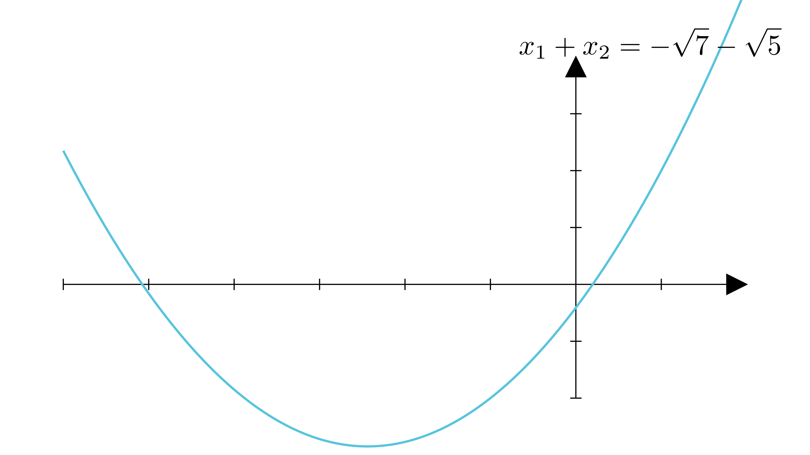

[⬅️ Назад кон Индексот](../README.md) | [🧰 Skill: logic](../../skill_guides/logic.md)

# Збир на координати на пресек (Виетови формули)

## 📝 Текст на задачата
Збирот на координатите на пресечните точки на графикот на функцијата $y = (\sqrt{7}-\sqrt{5})x^2 + 2x - \sqrt{7} + \sqrt{5}$ со апсцисната оска е еднаков на...

## 📐 Скица

  

## 🧠 Анализа
**Зошто е оваа задача тешка?**
Пресечните точки се $(x_1, 0)$ и $(x_2, 0)$. Збирот на координатите е $x_1 + x_2$. Користете Виетови формули: $x_1 + x_2 = -b/a$.

**Конструктивен потег:**
Пресечните точки се $(x_1, 0)$ и $(x_2, 0)$. Збирот на координатите е $x_1 + x_2$. Користете Виетови формули: $x_1 + x_2 = -b/a$.

## 💡 Решение

??? tip "Чекор 1: Виетова формула"
    $$ S = x_1 + x_2 = -\frac{b}{a} = -\frac{2}{\sqrt{7} - \sqrt{5}} $$

??? tip "Чекор 2: Рационализација"
    Множиме со $(\sqrt{7} + \sqrt{5})$:
    
    $$ S = -\frac{2(\sqrt{7} + \sqrt{5})}{(\sqrt{7} - \sqrt{5})(\sqrt{7} + \sqrt{5})} $$
    
    $$ S = -\frac{2(\sqrt{7} + \sqrt{5})}{7 - 5} $$
    
    $$ S = -\frac{2(\sqrt{7} + \sqrt{5})}{2} $$
    
    $$ S = -(\sqrt{7} + \sqrt{5}) = -\sqrt{7} - \sqrt{5} $$
    
    Одговорот е Опција 3.

## 🏁 Заклучок
Видете го решението погоре.

## 👩‍🏫 За наставници
Внимавајте на знакот минус пред дропката. Тој се однесува на целиот израз во заградата по кратењето.