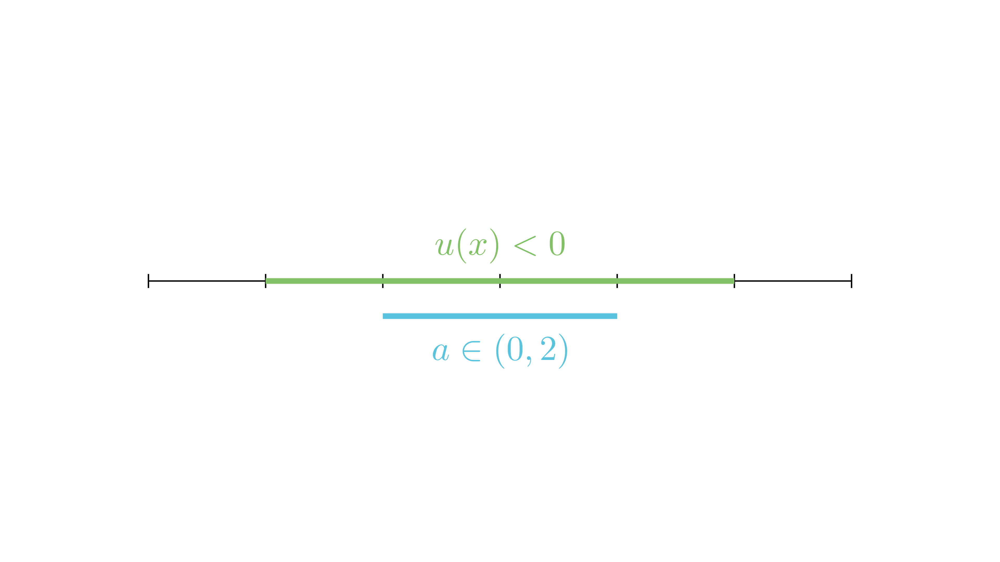

[⬅️ Назад кон Индексот](../README.md) | [🧰 Skill: logic](../../skill_guides/logic.md)

# Параметар и Signum функција

## 📝 Текст на задачата
Меѓу наведените интервали, одреди го оној во кој равенката $\frac{|x^2 - 2x - 3|}{x^2 - 2x - 3} + (x - a)^2 = 0$ има два различни корени.

## 📐 Скица

  

## 🧠 Анализа
**Зошто е оваа задача тешка?**
Дропката е $\text{sgn}(u(x))$. Таа може да биде $1$ или $-1$. Равенката е $1 + (x-a)^2 = 0$ (невозможно) или $-1 + (x-a)^2 = 0$ (можно). Значи, мораме да бидеме во зоната каде квадратниот трином е негативен, и таму решенијата $a \pm 1$ мора да постојат.

**Конструктивен потег:**
Дропката е $\text{sgn}(u(x))$. Таа може да биде $1$ или $-1$. Равенката е $1 + (x-a)^2 = 0$ (невозможно) или $-1 + (x-a)^2 = 0$ (можно). Значи, мораме да бидеме во зоната каде квадратниот трином е негативен, и таму решенијата $a \pm 1$ мора да постојат.

## 💡 Решение

??? tip "Чекор 3: Систем неравенки"
    1.  $a - 1 > -1 \implies a > 0$
    2.  $a + 1 < 3 \implies a < 2$
    
    Пресекот е $a \in (0, 2)$.
    Од понудените опции, само Опција 5 ($a \in (0, 2)$) е точна. (Забелешка: на сликата опција 5 е $a \in (0, 2)$).

## 🏁 Заклучок
Видете го решението погоре.

## 👩‍🏫 За наставници
За разлика од Варијанта 1, овде знакот плус пред квадратот ја менува логиката. Решенија има само таму каде што функцијата е негативна.