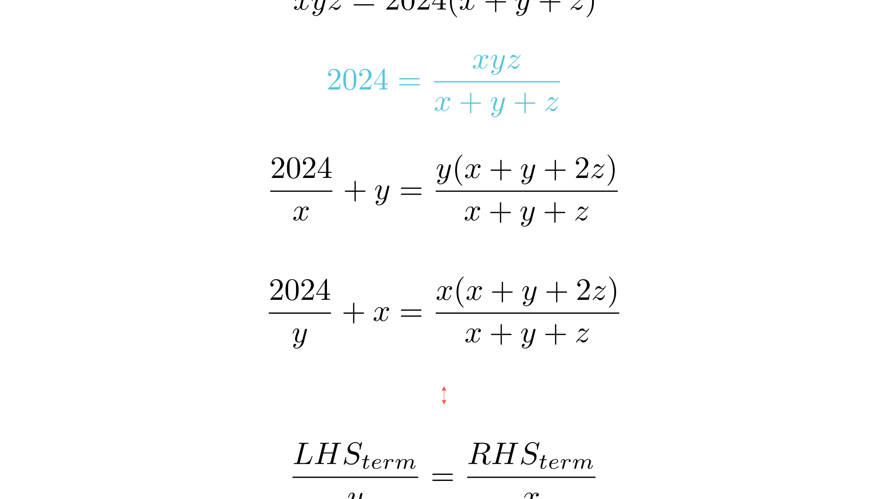

# Симетрија и Диофантови равенки

# Текст на задачата
Нека $x, y, z$ се позитивни реални броеви такви што:

$$xyz = 2024(x + y + z)$$

а) Докажи дека важи идентитетот:

$$\left( \frac{2024}{x} + y \right) \left( \frac{2024}{y} + z \right) \left( \frac{2024}{z} + x \right) = \left( \frac{2024}{y} + x \right) \left( \frac{2024}{z} + y \right) \left( \frac{2024}{x} + z \right)$$

б) Дали постои барем една тројка од природни броеви $(x, y, z)$ кои го задоволуваат почетното равенство? Образложи го одговорот.

# 💡 Помош (Hints)

Кликни за мала помош

1. Наместо да работиш со бројот 2024, замени го со неговата вредност изразена преку $x, y$ и $z$ од условот.

$$2024 = \frac{xyz}{x + y + z}$$

2. Фокусирај се на еден од изразите во заградите, на пример $\frac{2024}{x} + y$, и доведи го до заеднички именител.

3. Што забележуваш кај броителот? Дали можеш да извлечеш заеднички фактор кој ја открива скриената симетрија?

# Решение
## 🧠 Експертска Анализа (Интуиција)
Кога ќе видиме задача каде специфичен број (како 2024 или 2025) игра централна улога, првиот инстинкт е дека неговата конкретна вредност не е важна за алгебарскиот доказ, туку неговата врска со променливите. Условот $xyz = 2024(x+y+z)$ ни кажува дека 2024 е „балансирачкиот фактор“ помеѓу производот и збирот на трите променливи.

**Тригерот:** Изразот под а) изгледа симетрично, но со мала „ротација“ на променливите. Ако директно го множиме, ќе добиеме хаос од членови. Клучот е во **паметната супституција**. Што ако го изразиме 2024 како дел од структурата на равенката? Ако успееме да покажеме дека секој член од левата страна е пропорционален на соодветен член од десната страна, производот ќе се изедначи.

За делот под б), ова е класична потрага по целобројно решение (Диофантова равенка). Бидејќи имаме 3 променливи и само една равенка, имаме „слобода“ да фиксираме некои вредности за да го поедноставиме проблемот.

## 📐 Детално Решение

Чекор 1: Трансформација на поединечните членови — формула: 2024 = xyz/(x+y+z)

Од почетниот услов $xyz = 2024(x+y+z)$, можеме да изразиме:

$$2024 = \frac{xyz}{x+y+z}$$

Сега, да го разгледаме првиот член од левата страна на идентитетот:

$$\frac{2024}{x} + y = \frac{\frac{xyz}{x+y+z}}{x} + y = \frac{yz}{x+y+z} + y$$

Доведуваме на заеднички именител:

$$\frac{yz + y(x+y+z)}{x+y+z} = \frac{yz + xy + y^2 + yz}{x+y+z} = \frac{y(x + y + 2z)}{x+y+z}$$

Сега, да го разгледаме соодветниот член од десната страна, но оној што има исти променливи во „јадрото“, а тоа е $\frac{2024}{y} + x$:

$$\frac{2024}{y} + x = \frac{xz}{x+y+z} + x = \frac{xz + x(x+y+z)}{x+y+z} = \frac{x(x+y+2z)}{x+y+z}$$

Чекор 2: Воспоставување на пропорционалност

Забележуваме дека двата изрази што ги пресметавме го имаат истиот фактор $(x+y+2z)$ во броителот. Да ги означиме како:

$$A = \frac{2024}{x} + y = \frac{y}{x+y+z} \cdot (x+y+2z)$$
$$B = \frac{2024}{y} + x = \frac{x}{x+y+z} \cdot (x+y+2z)$$

Оттука е очигледно дека:

$$\frac{1}{y} \left( \frac{2024}{x} + y \right) = \frac{x+y+2z}{x+y+z} = \frac{1}{x} \left( \frac{2024}{y} + x \right)$$

Или подиректно:

$$\left( \frac{2024}{x} + y \right) = \frac{y}{x} \left( \frac{2024}{y} + x \right)$$

Чекор 3: Финализирање на производот (Доказ под а)

Применувајќи ја истата логика на сите три пара загради со циклична замена:

$$\left( \frac{2024}{y} + z \right) = \frac{z}{y} \left( \frac{2024}{z} + y \right)$$
$$\left( \frac{2024}{z} + x \right) = \frac{x}{z} \left( \frac{2024}{x} + z \right)$$

Множејќи ги левите страни и десните страни на овие три еднаквости, добиваме:

$$LHS = \left( \frac{y}{x} \cdot \frac{z}{y} \cdot \frac{x}{z} \right) \cdot \left( \frac{2024}{y} + x \right) \left( \frac{2024}{z} + y \right) \left( \frac{2024}{x} + z \right)$$

Бидејќи $\frac{y}{x} \cdot \frac{z}{y} \cdot \frac{x}{z} = 1$, заклучуваме дека:

$$LHS = RHS$$

Со што идентитетот е докажан.

Чекор 4: Конструкција на целобројно решение (Дел под б)

Треба да одговориме дали постојат природни броеви $x, y, z$ такви што $xyz = 2024(x+y+z)$.
Равенката можеме да ја запишеме како:

$$\frac{1}{xy} + \frac{1}{yz} + \frac{1}{zx} = \frac{1}{2024}$$

Да пробаме со претпоставка дека $x=y$. Тогаш:

$$\frac{1}{x^2} + \frac{2}{xz} = \frac{1}{2024} \implies \frac{z + 2x}{x^2 z} = \frac{1}{2024}$$
$$2024z + 4048x = x^2 z \implies z(x^2 - 2024) = 4048x$$
$$z = \frac{4048x}{x^2 - 2024}$$

За $z$ да биде природен број, доволно е да избереме $x$ така што $x^2 - 2024$ е делител на $4048x$.
Ако земеме $x = 46$ (забележи дека $46^2 = 2116 > 2024$):

$$z = \frac{4048 \cdot 46}{2116 - 2024} = \frac{4048 \cdot 46}{92} = \frac{4048}{2} = 2024$$

Значи, тројката $(46, 46, 2024)$ е едно решение во природни броеви.
Проверка: $46 \cdot 46 \cdot 2024 = 2116 \cdot 2024$ и $2024(46 + 46 + 2024) = 2024 \cdot 2116$. Точно!

**Краен одговор:** 
**а) Докажано преку циклична супституција.**
**б) Да, постои (на пр. $\boxed{(46, 46, 2024)}$).**

---
### 🎨 Визуелизација

## 👨‍🏫 Менторски Белешки
1.  **Златен Совет:** Кај задачи со изрази од типот $xyz = k(x+y+z)$, секогаш барај ја врската $\frac{k}{xy} + \frac{k}{yz} + \frac{k}{zx} = 1$. Ова е често „скриената“ форма на симетријата.
2.  **Чести Грешки:** Учениците често се обидуваат да ги измножат заградите под а), што доведува до многу долги изрази каде лесно се прави техничка грешка. Секогаш претпочитај „блоковско“ размислување — докажи својство за еден дел, па искористи ја симетријата за другите.
3.  **Зошто ова е важно:** Оваа задача ги подготвува учениците за посложени идентитети во теоријата на броеви и алгебарските неравенства (како Nesbitt-овата неравенство или Schur-овата неравенство).

### 🔗 Поврзани вештини
* **Примарна вештина:** Алгебарска манипулација и рационализација.
* **Потребни предзнаења:** Работа со рационални алгебарски изрази и Диофантови равенки (основи).