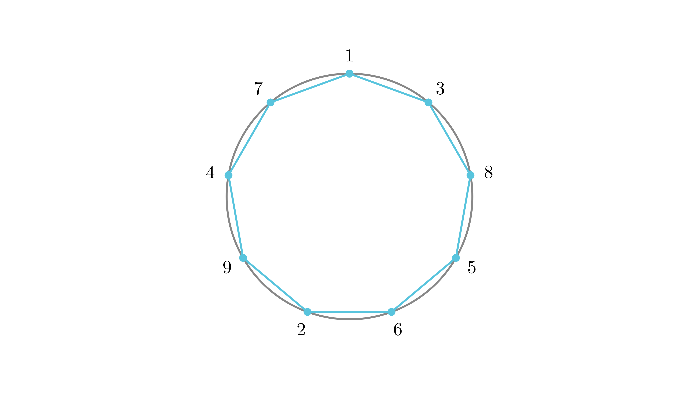

[⬅️ Назад кон Индексот](../../README.md) | [🧰 Skill: logic](../../../tools/skill_guides/logic.md)

# Броеви на кружница

## 📝 Текст на задачата
Дали е можно броевите 1, 2, 3, 4, 5, 6, 7, 8, 9 да се запишат на кружница така што збирот на било кои два соседни броја НЕ е делив ниту со 3, ниту со 5, ниту со 7?

## 📐 Скица

  

> Одете во `assets/manim_code_log.md`, копирајте го кодот за `Task_2023_mun_y1_2b` и генерирајте ја сликата.

## 🧠 Анализа
**Зошто е оваа задача тешка?**
Ова е проблем на конструкција. Треба да ги избегнеме „лошите“ парови. На пример, 1 не смее до 2 (збир 3), до 4 (збир 5), до 6 (збир 7). Направете листа на забранети соседи за секој број и обидете се да ги поврзете.

**Конструктивен потег:**
Ова е проблем на конструкција. Треба да ги избегнеме „лошите“ парови. На пример, 1 не смее до 2 (збир 3), до 4 (збир 5), до 6 (збир 7). Направете листа на забранети соседи за секој број и обидете се да ги поврзете.

## 💡 Решение

## 💡 Решение

??? tip "Чекор 1: Забранети парови"
    *   Збир делив со 3: (1,2), (1,5), (1,8), (2,4), (2,7), (3,6), (3,9), (4,5), (4,8), (5,7), (7,8).
    *   Збир делив со 5: (1,4), (1,9), (2,3), (2,8), (3,7), (4,6), (6,9).
    *   Збир делив со 7: (1,6), (2,5), (3,4), (5,9), (6,8).

??? tip "Чекор 2: Анализа на „тешките“ броеви"
    Бројот 1 не смее со: 2, 4, 5, 6, 8, 9. Дозволени соседи за 1 се само **3 и 7**.
    Значи, во кругот мора да имаме секвенца ...-3-1-7-...
    
    Бројот 2 не смее со: 1, 3, 4, 5, 7, 8. Дозволени соседи за 2 се само **6 и 9**.
    Секвенца: ...-6-2-9-...
    
    Бројот 4 не смее со: 1, 2, 3, 5, 6, 8. Дозволени соседи за 4 се само **7 и 9**.
    Секвенца: ...-7-4-9-...

??? tip "Чекор 3: Спојување"
    Имаме фрагменти:
    (3-1-7), (6-2-9), (7-4-9).
    Можеме да ги споиме преку заедничките броеви 7 и 9.
    ...3-1-**7**-4-**9**-2-6...
    Останаа броевите 5 и 8.
    Каде може 5? Не смее до 1, 2, 4, 7, 9. Може до 3, 6, 8.
    Каде може 8? Не смее до 1, 2, 4, 6, 7. Може до 3, 5, 9.
    
    Ајде да пробаме да го затвориме кругот:
    Синџир: 1-7-4-9-2-6.
    Краеви се 1 и 6. Треба да ги вметнеме 3, 5, 8.
    1 е поврзан со 3. Значи ...-6-?-?-?-3-1-...
    5 може до 6. 8 може до 5. 3 може до 8.
    Синџир: 6-5-8-3.
    Цел круг: **1-7-4-9-2-6-5-8-3-1**.

??? tip "Чекор 4: Проверка на новите врски"
    (6,5): 11 (OK). (5,8): 13 (OK). (8,3): 11 (OK). (3,1): 4 (OK).
    
    Одговор: Да, можно е. Распоред: 1, 7, 4, 9, 2, 6, 5, 8, 3.

## 🏁 Заклучок
Видете го решението погоре.

## 👩‍🏫 За наставници
Ова е одличен пример за логичка дедукција. Откритието дека 1, 2 и 4 имаат само по два можни соседи го решава проблемот автоматски.