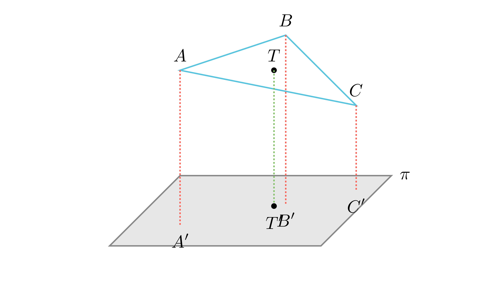

# Растојание од тежиште до рамнина

## Текст на задачата
Ортогоналната проекција на рамностраниот триаголник $\triangle ABC$ врз некоја рамнина е триаголникот $\triangle A'B'C'$. Ако $AA'=10$ cm, $BB'=15$ cm и $CC'=17$ cm, одреди го растојанието $TT'$ од тежиштето на триаголникот $\triangle ABC$ до рамнината.

## 📐 Скица / Конструкција

  

## 🧠 Анализа
Растојанието од тежиштето до рамнината е всушност аритметичка средина од растојанијата на неговите темиња до истата рамнина.

## 📝 Решение (СИНТЕТИЧКО)
1. **Координатен пристап:** Нека рамнината е $z=0$. Тогаш $z$-координатите на темињата се $z_A=10, z_B=15, z_C=17$. 
2. **Својство на тежиште:** Во просторот, координатите на тежиштето $T$ се аритметичка средина од координатите на темињата. Специфично за вертикалното растојание: $z_T = \frac{z_A + z_B + z_C}{3}$. 
3. **Пресметка:** $TT' = \frac{10 + 15 + 17}{3} = \frac{42}{3} = 14$ cm. 
4. **Забелешка:** Фактот дека триаголникот е рамностран е вишок податок; својството важи за секој триаголник.

## ⚠️ Аналитички пристап (само ако е неизбежен)
<Ако мора да се користат координати, објасни зошто синтетичкиот пат е претежок.>

## 🏁 Заклучок
Видете го решението погоре.