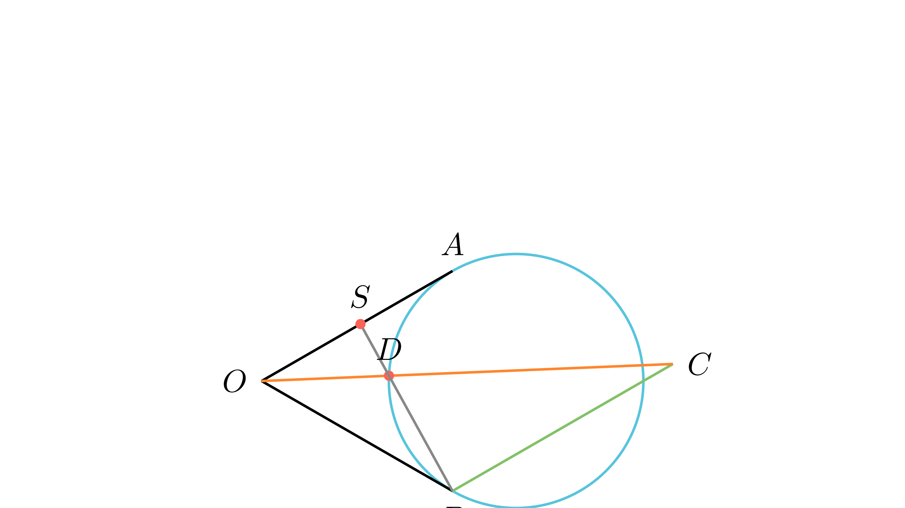

# Средина на тангентна отсечка

## Текст на задачата
Кружница $k$ ги допира краците на агол со теме $O$, во точките $A$ и $B$. Правата која минува низ $B$ и е паралелна со кракот $OA$ ја сече кружницата во точката $C$, а отсечката $OC$ ја сече кружницата во точката $D$. Докажи дека правата $BD$ минува низ средината на отсечката $OA$.

## 📐 Скица / Конструкција

{ width=500 }
## 🧠 Анализа
За да докажеме дека $S$ е средина на $OA$, доволно е да покажеме дека $SO^2 = SA^2$. Користи го својството на тангента и секанта за $SA$, а сличноста на триаголници за $SO$.

## 📝 Решение (СИНТЕТИЧКО)
1. **Стратегија:** Нека $S$ е пресекот на $BD$ и $OA$. Бараме доказ за $OS=SA$. 
2. **Потенција на точка:** Од својството на тангента и секанта за точката $S$ и кружницата $k$ важи: $SA^2 = SD \cdot SB$. 
3. **Агли и паралелност:** Бидејќи $BC \parallel OA$, аглите $\angle COA$ и $\angle BCO$ се наизменични, па $\angle DOA = \angle BCD$. Исто така, аголот меѓу тангентата $OB$ и тетивата $BD$ ($\angle SBO$) е еднаков на периферискиот агол $\angle BCD$ над истата тетива. Оттука, $\angle SOD = \angle SBO$. 
4. **Сличност:** Триаголниците $\triangle SDO$ и $\triangle SOB$ имаат заеднички агол кај $S$ и докажано еднакви агли $\angle SOD = \angle SBO$. Според признакот АА, $\triangle SDO \sim \triangle SOB$. 
5. **Метричка релација:** Од сличноста следува $\frac{SD}{SO} = \frac{SO}{SB}$, што дава $SO^2 = SD \cdot SB$. 
6. **Заклучок:** Бидејќи $SO^2 = SD \cdot SB$ и $SA^2 = SD \cdot SB$, следува $SO^2 = SA^2$, односно $OS=SA$.

## ⚠️ Аналитички пристап (само ако е неизбежен)
<Ако мора да се користат координати, објасни зошто синтетичкиот пат е претежок.>

## 🏁 Заклучок
Видете го решението погоре.