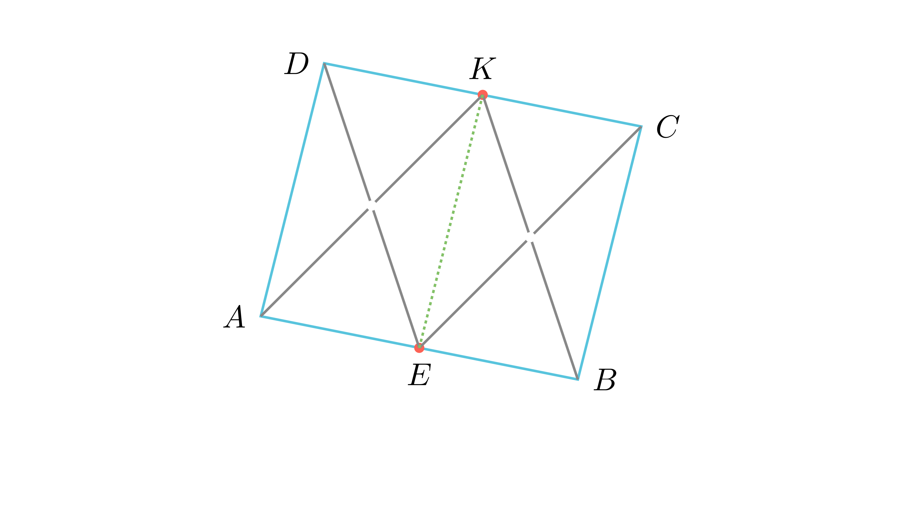

# Паралелограм од средини на отсечки

## Текст на задачата
Даден е разностран четириаголник $ABCD$ кој нема паралелни страни. Точката $E$ е средина на отсечката $AB$, а точката $K$ е средина на отсечката $CD$. Докажи дека средишните точки на отсечките $AK, CE, BK$ и $DE$ се темиња на паралелограм.

## 📐 Скица / Конструкција
<Опис на цртежот. Кои се клучните точки? Дали има помошни линии?>

  

## 🧠 Анализа
Користи ја средната линија во триаголниците формирани од $E$ и $K$ за да покажеш дека дијагоналите на новиот четириаголник се преполовуваат.

## 📝 Решение (СИНТЕТИЧКО)
**Елегантен метод (Синтетички):** 
1. Нека $M, N, P, Q$ се средините на $AK, CE, BK, DE$. 
2. Во $\triangle ABK$, $EM$ е средна линија ($EM \parallel BK, EM = \frac{1}{2}BK$). Бидејќи $P$ е средина на $BK$, следува $EM \parallel PK$ и $EM = PK$, па $MEPK$ е паралелограм. 
3. Аналогно, во $\triangle CDE$, $KQ$ е средна линија, па $ENKQ$ е паралелограм. 
4. Двата паралелограми ја имаат $EK$ како дијагонала. Бидејќи дијагоналите во паралелограм се преполовуваат, средините на $MP$ и $NQ$ се совпаѓаат со средината на $EK$. Оттука, $MNPQ$ е паралелограм. 

**Алтернативен метод (Векторски):** 
1. Нека $O$ е почеток. $e = \frac{a+b}{2}, k = \frac{c+d}{2}$. 
2. Средините се $m_1 = \frac{a+k}{2}, m_2 = \frac{c+e}{2}, m_3 = \frac{b+k}{2}, m_4 = \frac{d+e}{2}$. 
3. Средишната точка на $M_1M_3$ е $\frac{m_1+m_3}{2} = \frac{a+b+2k}{4} = \frac{a+b+c+d}{4}$. 
4. Средишната точка на $M_2M_4$ е $\frac{m_2+m_4}{2} = \frac{c+d+2e}{4} = \frac{c+d+a+b}{4}$. Бидејќи се еднакви, четириаголникот е паралелограм.

## ⚠️ Аналитички пристап (само ако е неизбежен)
<Ако мора да се користат координати, објасни зошто синтетичкиот пат е претежок.>

## 🏁 Заклучок
Видете го решението погоре.