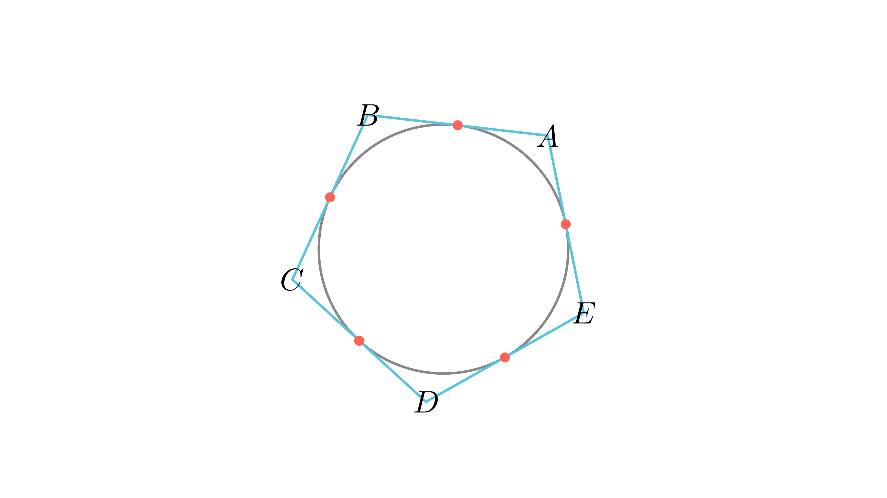

# Постоење на впишана кружница во петтоаголник

## Текст на задачата
Страните на еден петтоаголник последователно се еднакви на 4 cm, 6 cm, 8 cm, 7 cm и 9 cm. Дали во овој петтоаголник може да се впише кружница? Образложи го својот одговор!

## 📐 Скица / Конструкција

  

## 🧠 Анализа
Ако постои впишана кружница, допирните точки ги делат страните на отсечки чии должини мора да бидат строго позитивни. Постави систем равенки.

## 📝 Решение (СИНТЕТИЧКО)
1. **Моделирање:** Нека темињата се $A, B, C, D, E$. Означуваме $x$ како растојание од $A$ до допирните точки. Тогаш останатите отсечки се: $y=4-x$ (на $AB$), $z=6-y$ (на $BC$), $u=8-z$ (на $CD$), $v=7-u$ (на $DE$) и конечно $x+v=9$ (на $EA$). 
2. **Решавање:** Со замена во системот добиваме: $z = 2+x$, $u = 6-x$, $v = 1+x$. Од последната равенка $x + (1+x) = 9$ следува $2x = 8$, па $x = 4$. 
3. **Проверка на физибилност:** За $x=4$, ги наоѓаме вредностите: $y=0, z=6, u=2, v=5$. 
4. **Логички заклучок:** Бидејќи $y=0$, допирната точка се совпаѓа со темето $B$. За впишана кружница во конвексен многуаголник, сите отсечки мора да бидат строго позитивни ($x,y,z,u,v > 0$). Бидејќи една вредност е нула, кружница не може да се впише.

## ⚠️ Аналитички пристап (само ако е неизбежен)
<Ако мора да се користат координати, објасни зошто синтетичкиот пат е претежок.>

## 🏁 Заклучок
Видете го решението погоре.