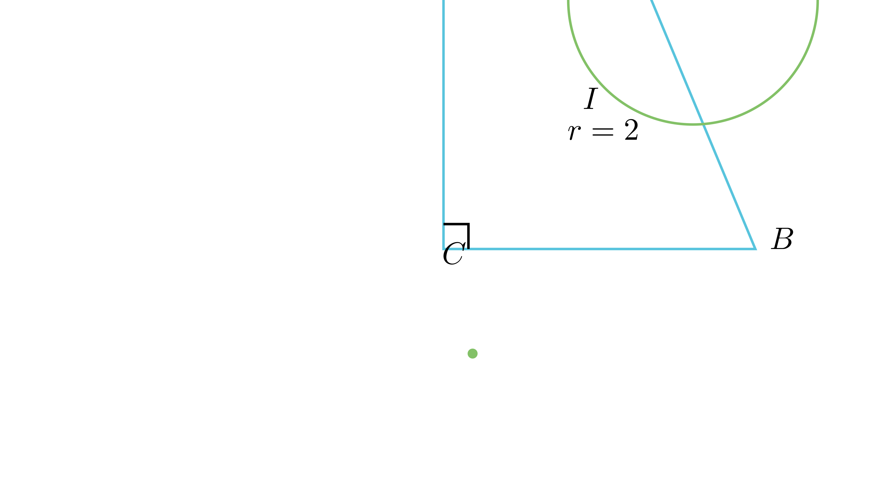

# Хипотенуза преку периметар и впишан радиус

## Текст на задачата
Периметарот на еден правоаголен триаголник е $30$ cm, а радиусот на впишаната кружница е $2$ cm. Пресметај ја должината на хипотенузата.

## 📐 Скица / Конструкција

  

## 🧠 Анализа
Користи ја специјалната формула за радиус на впишана кружница во правоаголен триаголник: $r = (a+b-c)/2$.

## 📝 Решение (СИНТЕТИЧКО)
1. **Поставка:** Нека $a, b$ се катети, а $c$ е хипотенуза. Дадено е $a+b+c = 30$ и $r=2$.
2. **Замена:** Од периметарот, $a+b = 30 - c$. 
3. **Формула:** За правоаголен триаголник важи $r = \frac{a+b-c}{2}$. Заменуваме: $2 = \frac{(30-c)-c}{2}$.
4. **Решавање:** $4 = 30 - 2c \implies 2c = 26 \implies c = 13$ cm.

## ⚠️ Аналитички пристап (само ако е неизбежен)
<Ако мора да се користат координати, објасни зошто синтетичкиот пат е претежок.>

## 🏁 Заклучок
Видете го решението погоре.