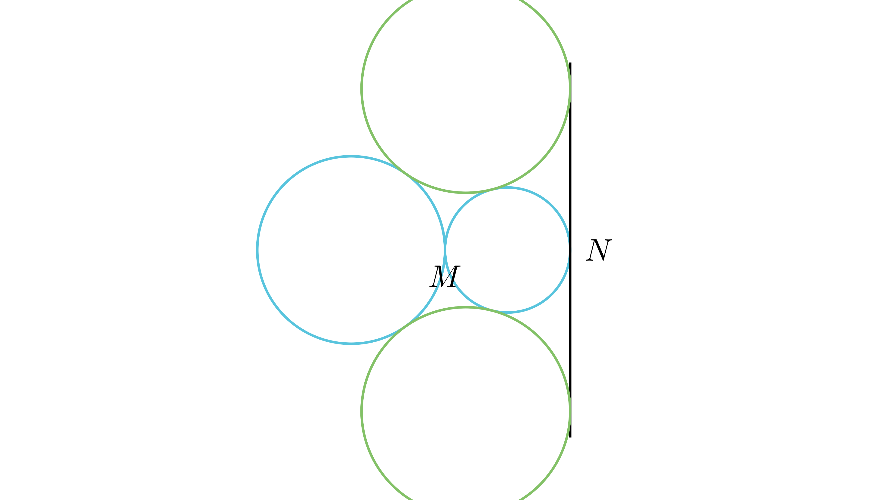

# Радиус на трета кружница при допир

## Текст на задачата
Две кружници $k_1(O_1, R)$ и $k_2(O_2, r)$ се допираат однадвор во точката $M$. На кружницата $k_2$ избрана е точката $N$ која е дијаметрално спротивна на $M$. Низ $N$ повлечена е тангента $t$ на $k_2$. Одреди го радиусот на трета кружница $k_3$ за која $t$ е тангента и која однадвор ги допира $k_1$ и $k_2$.

## 📐 Скица / Конструкција
<Опис на цртежот. Кои се клучните точки? Дали има помошни линии?>

  

## 🧠 Анализа
Постави координатен систем каде тангентата $t$ е y-оската, а дијаметарот $MN$ е на x-оската. Користи го растојанието меѓу центрите како збир на радиусите.

## 📝 Решение (СИНТЕТИЧКО)
1. **Координати:** Нека $N(0,0)$ и тангентата $t$ е y-оската. Тогаш $O_2(-r, 0)$, $M(-2r, 0)$ и $O_1(-2r-R, 0)$. Нека $k_3$ има радиус $x$ и центар $O_3(-x, y)$. 
2. **Услов за $k_2$ и $k_3$:** Растојанието $O_2O_3 = r+x$. Со Питагора: $(r-x)^2 + y^2 = (r+x)^2$, што дава $y^2 = 4rx$. 
3. **Услов за $k_1$ и $k_3$:** Растојанието $O_1O_3 = R+x$. Со Питагора: $(2r+R-x)^2 + y^2 = (R+x)^2$. 
4. **Решавање:** Заменуваме $y^2 = 4rx$ во втората равенка: $(2r+R-x)^2 + 4rx = (R+x)^2$. Со развој и кратење: $4r^2 + 4rR + R^2 - 4rx - 2Rx + x^2 + 4rx = R^2 + 2Rx + x^2$. 
5. **Финале:** Се поедноставува во $4r^2 + 4rR = 4Rx$, од каде $x = \frac{r(r+R)}{R}$.

## ⚠️ Аналитички пристап (само ако е неизбежен)
<Ако мора да се користат координати, објасни зошто синтетичкиот пат е претежок.>

## 🏁 Заклучок
Видете го решението погоре.