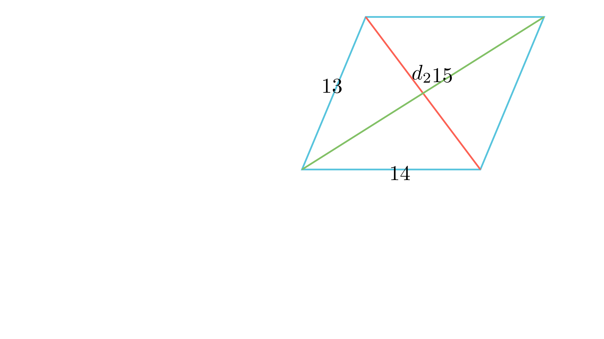

# Втора дијагонала на паралелограм

## Текст на задачата
Двете страни на еден паралелограм се $13$ cm и $14$ cm, а една од неговите дијагонали е $15$ cm. Колку изнесува другата дијагонала?

## 📐 Скица / Конструкција
<Опис на цртежот. Кои се клучните точки? Дали има помошни линии?>

  

## 🧠 Анализа
Стратегија: Директна примена на **Идентитетот на паралелограм** (Законот за паралелограм), кој е вон-училишна, но фундаментална олимписка теорема.

## 📝 Решение (СИНТЕТИЧКО)
1. **Теорема (Идентитет на паралелограм):** Збирот на квадратите на дијагоналите на паралелограм е еднаков на двојниот збир на квадратите на неговите страни: $d_1^2 + d_2^2 = 2(a^2 + b^2)$.
2. **Замена на вредности:** Нека $a=14, b=13$ и $d_1=15$. Имаме: $15^2 + d_2^2 = 2(14^2 + 13^2)$.
3. **Пресметка:** $225 + d_2^2 = 2(196 + 169) = 2(365) = 730$.
4. **Резултат:** $d_2^2 = 730 - 225 = 505$, па $d_2 = \sqrt{505}$ cm.

## ⚠️ Аналитички пристап (само ако е неизбежен)
<Ако мора да се користат координати, објасни зошто синтетичкиот пат е претежок.>

## 🏁 Заклучок
Видете го решението погоре.