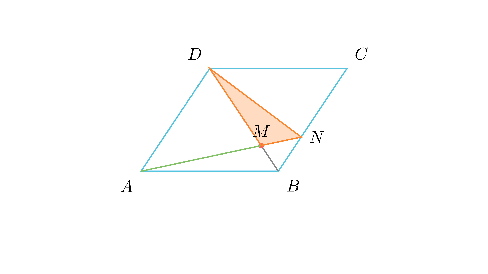

# Однос на плоштини во поделен паралелограм

## Текст на задачата
Точката $M$ лежи на дијагоналата $BD$ на паралелограмот $ABCD$, така што $MD=3BM$. Нека правите $AM$ и $BC$ се сечат во точка $N$. Одреди го односот од плоштината на триаголникот $MND$ и плоштината на паралелограмот $ABCD$.

## 📐 Скица / Конструкција

{ width=500 }
## 🧠 Анализа
Стратегија: Искористете ја дијагоналата за да ја поделите плоштината на познати делови и користете ја 'пеперутка сличноста' за да го најдете односот на отсечките на правата $AN$.

## 📝 Решение (СИНТЕТИЧКО)
1. **Дел од дијагонала:** Нека $P$ е плоштината на паралелограмот. $P_{ABD} = \frac{1}{2}P$. Бидејќи $MD = 3BM$, тогаш $MD = \frac{3}{4}BD$. Триаголниците $AMD$ и $ABD$ имаат заедничка висина кон $BD$, па $P_{AMD} = \frac{3}{4} P_{ABD} = \frac{3}{4} \cdot \frac{1}{2}P = \frac{3}{8}P$.
2. **Сличност (Butterfly):** Бидејќи $AD \parallel BC$, $\triangle NBM \sim \triangle DAM$. Односот на сличност е $\frac{NM}{AM} = \frac{BM}{MD} = \frac{1}{3}$.
3. **Однос на плоштини:** Триаголниците $MND$ и $AMD$ имаат заедничка висина спуштена од $D$ кон правата $AN$. Тогаш $\frac{P_{MND}}{P_{AMD}} = \frac{NM}{AM} = \frac{1}{3}$.
4. **Финале:** $P_{MND} = \frac{1}{3} P_{AMD} = \frac{1}{3} \cdot \frac{3}{8}P = \frac{1}{8}P$. Бараниот однос е $1:8$.

## ⚠️ Аналитички пристап (само ако е неизбежен)
<Ако мора да се користат координати, објасни зошто синтетичкиот пат е претежок.>

## 🏁 Заклучок
Видете го решението погоре.