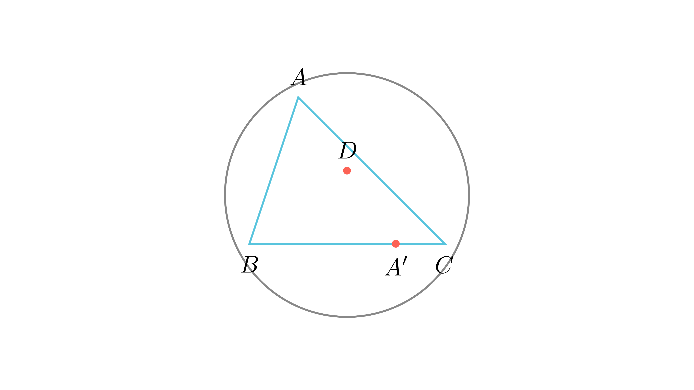

---
allowed_tools:
- classical_euclidean
- similarity
- symmetry
difficulty: 8
field: geometry
forbidden_tools:
- coordinate_geometry
- vectors
- complex_numbers
geometry_style: synthetic
grade: 9
language_original: <mk | en | sr | hr | ...>
primary_skill: <main_tool>
problem_id: geom_9_symm_point_circumcircle
related_skills:
- cyclic_quadrilaterals
- similarity
related_theorems:
- symmetry
- similarity
source: <натпревар / списание / година>
tags:
- geometry
- olympiad
translated: false
---

# Симетрична точка на опишана кружница

## Текст на задачата
Точката $D$ е во внатрешноста на остроаголниот триаголник $ABC$ за кој важат равенствата $\angle ADB = \angle CDA = 180^\circ - \angle BAC$. Докажи дека симетричната точка $A'$ на точката $A$ во однос на точката $D$ лежи на опишаната кружница околу триаголникот $ABC$.

## 📐 Скица / Конструкција

{ width=500 }
## 🧠 Анализа
Хеуристика: 'Докажи тетивност преку суплементни агли'. Треба да покажеме дека $\angle BA'C + \angle BAC = 180^\circ$. Прво докажете ја сличноста на триаголниците со точката $D$.

## 📝 Решение (СИНТЕТИЧКО)
1. **Сличност:** Нека $\angle BAC = \alpha$. Со 'лов на агли' добиваме дека $\triangle ABD \sim \triangle CAD$ (бидејќи имаат два еднакви агли $\alpha-x$ и $\alpha-y$). Од ова следува $AD^2 = BD \cdot CD$.
2. **Втора сличност:** Бидејќи $A'D = AD$ (симетрија), тогаш $A'D^2 = BD \cdot CD$, односно $\frac{BD}{A'D} = \frac{A'D}{CD}$. Бидејќи $\angle BDA' = \angle CDA' = \alpha$ (суплементни на $180-\alpha$), следува $\triangle BDA' \sim \triangle A'DC$ (признак САС).
3. **Агли на четириаголникот:** Од сличноста во чекор 2, наоѓаме дека $\angle BA'D + \angle DA'C = 180^\circ - \alpha$.
4. **Заклучок:** Во четириаголникот $ABA'C$, $\angle BAC + \angle BA'C = \alpha + (180^\circ - \alpha) = 180^\circ$. Бидејќи збирот на спротивните агли е $180^\circ$, четириаголникот е тетивен, па $A'$ лежи на кружницата.

## ⚠️ Аналитички пристап (само ако е неизбежен)
<Ако мора да се користат координати, објасни зошто синтетичкиот пат е претежок.>

## 🏁 Заклучок
Видете го решението погоре.