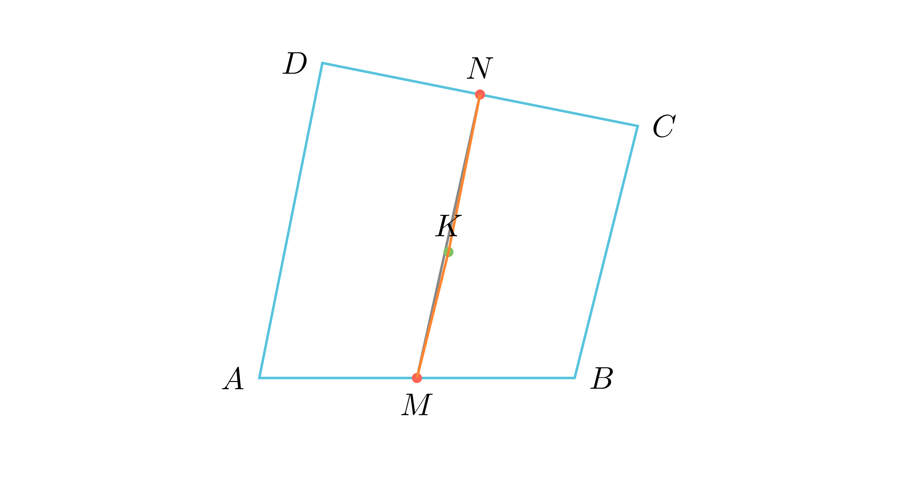

---
allowed_tools:
- classical_euclidean
- similarity
- symmetry
difficulty: 7
field: geometry
forbidden_tools:
- coordinate_geometry
- vectors
- complex_numbers
geometry_style: synthetic
grade: 9
language_original: <mk | en | sr | hr | ...>
primary_skill: <main_tool>
problem_id: geom_9_quad_parallel_proof
related_skills:
- midsegment_theorem
- collinearity
related_theorems:
- vectors
source: <натпревар / списание / година>
tags:
- geometry
- olympiad
translated: false
---

# Паралелност преку средна линија на спротивни страни

## Текст на задачата
Нека $ABCD$ е конвексен четириаголник, кај кој должината на отсечката што ги поврзува средните точки на двете спротивни страни $AB$ и $CD$ е еднаква на $\frac{AD+BC}{2}$. Докажи дека правата $AD$ е паралелна со правата $BC$.

## 📐 Скица / Конструкција

{ width=500 }
## 🧠 Анализа
Хеуристика: 'Граничен случај на неравенство'. Во секој четириаголник важи $MN \le \frac{AD+BC}{2}$. Еднаквоста се постигнува само кога векторите на страните се колинеарни.

## 📝 Решение (СИНТЕТИЧКО)
1. **Конструкција:** Нека $M$ и $N$ се средини на $AB$ и $CD$. Воведуваме помошна точка $K$ која е средина на дијагоналата $AC$.
2. **Средни линии:** Во $\triangle ABC$, $MK$ е средна линија, па $MK = \frac{BC}{2}$ и $MK \parallel BC$. Во $\triangle ACD$, $KN$ е средна линија, па $KN = \frac{AD}{2}$ и $KN \parallel AD$.
3. **Неравенство на триаголник:** За точките $M, K, N$ важи $MN \le MK + KN$. Заменувајќи ги вредностите: $MN \le \frac{BC}{2} + \frac{AD}{2} = \frac{AD+BC}{2}$.
4. **Анализа на еднаквоста:** Дадено е дека $MN = \frac{AD+BC}{2}$, што значи дека во неравенството важи знакот за еднаквост. Ова е можно само ако точките $M, K, N$ се колинеарни (лежат на иста права).
5. **Заклучок:** Бидејќи $MK \parallel BC$ и $KN \parallel AD$, а тие лежат на иста права, следува дека $AD \parallel BC$.

## ⚠️ Аналитички пристап (само ако е неизбежен)
<Ако мора да се користат координати, објасни зошто синтетичкиот пат е претежок.>

## 🏁 Заклучок
Видете го решението погоре.