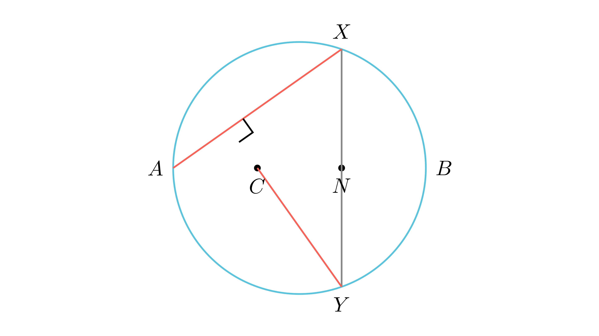

---
allowed_tools:
- classical_euclidean
- similarity
- symmetry
difficulty: 8
field: geometry
forbidden_tools:
- coordinate_geometry
- vectors
- complex_numbers
geometry_style: synthetic
grade: 9
language_original: <mk | en | sr | hr | ...>
primary_skill: <main_tool>
problem_id: geom_9_construct_perp_axcy
related_skills:
- similarity
- symmetry
related_theorems:
- similarity
source: <натпревар / списание / година>
tags:
- geometry
- olympiad
translated: false
---

# Конструкција на нормални прави во кружница

## Текст на задачата
Нека $k$ е кружница со дијаметар $AB$, и нека $C$ е произволна точка од отсечката $AB$. Најди две точки $X$ и $Y$ од кружницата $k$ кои се симетрични во однос на $AB$ и такви што правите $AX$ и $CY$ се заемно нормални.

## 📐 Скица / Конструкција

{ width=500 }
## 🧠 Анализа
Проекцијата на точката $X$ врз дијаметарот $AB$ го крие клучот. Користи сличност на правоаголни триаголници за да ја најдеш врската помеѓу $C$, $B$ и подножјето на нормалата.

## 📝 Решение (СИНТЕТИЧКО)
1. **Означување:** Нека $N$ е подножјето на нормалата од $X$ кон $AB$. Бидејќи $X$ и $Y$ се симетрични во однос на $AB$, $N$ е и подножје на нормалата од $Y$, при што $XN = NY$.
2. **Агли:** Нека $\angle BAX = \alpha$. Од условот $AX \perp CY$, во правоаголниот $\triangle AMC$ (каде $M$ е пресекот) имаме $\angle ACM = 90^\circ - \alpha$. Тогаш во правоаголниот $\triangle CNY$, $\angle NYC = \alpha$.
3. **Сличност:** $\triangle ANX \sim \triangle CNY$ (според АА), па $AN/XN = YN/CN$. Бидејќи $XN=YN$, добиваме $XN^2 = AN \cdot CN$.
4. **Метрика на кружница:** Во правоаголниот $\triangle AXB$, $XN$ е висина, па $XN^2 = AN \cdot NB$.
5. **Изедначување:** $AN \cdot CN = AN \cdot NB \implies CN = NB$.
6. **Заклучок:** Точката $N$ е средина на отсечката $CB$. Точките $X$ и $Y$ се пресеци на кружницата со нормалата на $AB$ повлечена низ средината на $CB$.

## ⚠️ Аналитички пристап (само ако е неизбежен)
<Ако мора да се користат координати, објасни зошто синтетичкиот пат е претежок.>

## 🏁 Заклучок
Видете го решението погоре.