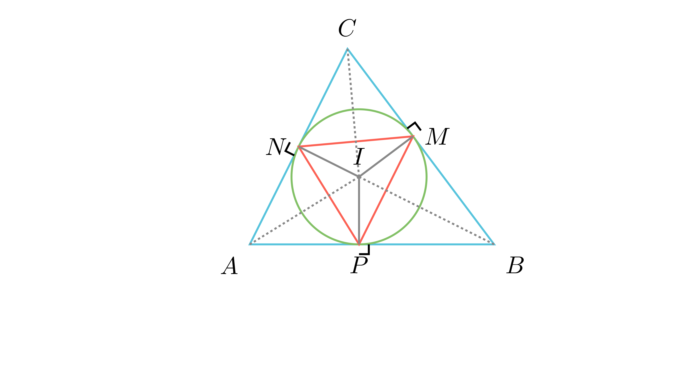

# Страни на контактниот триаголник

## Текст на задачата
Во $\triangle ABC$ со страни $a, b, c$ и впишан радиус $r$, точките на допир ја формираат $\triangle MNP$. Изрази ги страните на $\triangle MNP$ преку $a, b, c$ и $r$.

## 📐 Скица / Конструкција

  

## 🧠 Анализа
Разгледај го рамнокракиот триаголник формиран од две тангентни отсечки и тетивата (страната на MNP). Користи ја висината кон хипотенузата во правоаголниот триаголник формиран со центарот на кружницата.

## 📝 Решение (СИНТЕТИЧКО)
1. **Тангентни отсечки:** Од темето $A$, тангентните отсечки до точките $P$ и $N$ се еднакви на $s-a$, каде $s$ е полупериметар.
2. **Правоаголен триаголник:** Центарот $I$, темето $A$ и допирната точка $N$ формираат правоаголен $\triangle ANI$ (прав агол кај $N$) со катети $s-a$ и $r$.
3. **Хипотенуза:** Според Питагора, $AI = \sqrt{(s-a)^2 + r^2}$.
4. **Висина:** Страната на контактниот триаголник $PN$ е двапати поголема од висината на $\triangle ANI$ спуштена кон $AI$. Плоштината $P = \frac{1}{2}r(s-a) = \frac{1}{2}AI \cdot \frac{PN}{2}$.
5. **Резултат:** $PN = \frac{2r(s-a)}{\sqrt{(s-a)^2 + r^2}}$. Аналогно се добиваат и другите две страни со замена на $(s-a)$ со $(s-b)$ и $(s-c)$.

## ⚠️ Аналитички пристап (само ако е неизбежен)
<Ако мора да се користат координати, објасни зошто синтетичкиот пат е претежок.>

## 🏁 Заклучок
Видете го решението погоре.