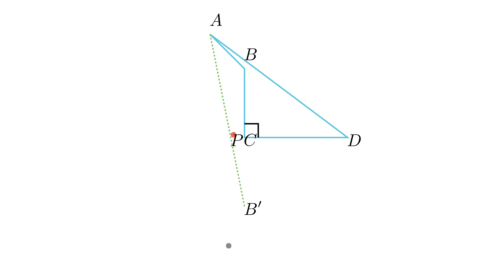

---
allowed_tools:
- classical_euclidean
- similarity
- symmetry
difficulty: 8
field: geometry
forbidden_tools:
- coordinate_geometry
- vectors
- complex_numbers
geometry_style: synthetic
grade: 9
language_original: <mk | en | sr | hr | ...>
primary_skill: <main_tool>
problem_id: geom_quad_symmetry_05
related_skills:
- symmetry
- reflection
- isosceles_properties
related_theorems:
- symmetry
source: <натпревар / списание / година>
tags:
- geometry
- olympiad
translated: false
---

# Симетрија во конвексен четириаголник

## Текст на задачата
Даден е конвексен четириаголник $ABCD$ кој има прав агол кај темето $C$. На страната $CD$ постои точка $P$ така што $\angle APD = \angle BPC$ и $\angle BAP = \angle ABC$. Докажи дека $BC = \frac{AP + BP}{2}$.

## 📐 Скица

{ width=500 }
 / Конструкција

<!-- VISUAL PROMPT: Draw a convex quadrilateral ABCD with a right angle at C. Mark a point P on side CD. Reflect point B across line CD to get B'. Connect A, P, and B' as a straight line. Mark equal angles APD and BPC. -->

## 🧠 Анализа
Хеуристика: Користи го правиот агол кај $C$ за да ја рефлектираш точката $B$ во однос на страната $CD$. Ова ќе ја 'исправи' искршената линија $AP + PB$ во една права отсечка.

## 📝 Решение (СИНТЕТИЧКО)
1. **Конструкција:** Ја продолжуваме страната $BC$ преку темето $C$ до точка $B'$, така што $BC = CB'$. Бидејќи $\angle BCD = 90^\circ$, правата $CD$ е симетрала на отсечката $BB'$.
2. **Својство на симетрија:** Бидејќи $P$ лежи на $CD$, следува $PB = PB'$ и $\triangle PCB \cong \triangle PCB'$. Оттука $\angle BPC = \angle B'PC$.
3. **Колинеарност:** Од условот $\angle APD = \angle BPC$ и најденото $\angle BPC = \angle B'PC$, следува дека $\angle APD$ и $\angle B'PC$ се накрсни агли, па точките $A, P, B'$ лежат на една права. Значи $AB' = AP + PB' = AP + BP$.
4. **Рамнокрак триаголник:** Од условот $\angle BAP = \angle ABC$ следува дека $\angle BAB' = \angle ABB'$, па $\triangle ABB'$ е рамнокрак со $AB' = BB'$.
5. **Заклучок:** Бидејќи $BB' = 2BC$, имаме $AP + BP = 2BC$, односно $BC = \frac{AP + BP}{2}$.

## ⚠️ Аналитички пристап (само ако е неизбежен)
<Ако мора да се користат координати, објасни зошто синтетичкиот пат е претежок.>

## 🏁 Заклучок
Видете го решението погоре.