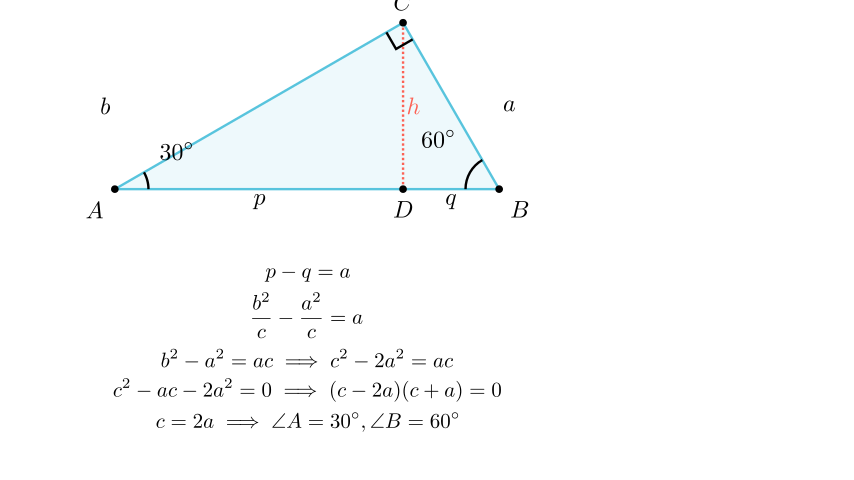

# Проекции на хипотенуза и агли

## Текст на задачата
Во правоаголен триаголник, висината спуштена кон хипотенузата ја дели хипотенузата на два дела чија разлика е еднаква на должината на едната катета. Определи ги аглите на триаголникот.

## 📐 Скица / Конструкција

## 💡 Решение

Нека $a$ и $b$ се катетите, а $c$ е хипотенузата на правоаголниот триаголник.
Нека $p$ и $q$ се проекциите на катетите $b$ и $a$ врз хипотенузата, соодветно.
Познато е дека $p = \frac{b^2}{c}$ и $q = \frac{a^2}{c}$.
Дадено е дека разликата на проекциите е еднаква на едната катета.
Без губење на општоста, нека $p > q$, па условот е $p - q = a$ (бидејќи $p$ е проекција на $b$, а $b > a$ ако $p > q$, па разликата може да биде $a$).
Ако $p - q = b$, тогаш $p > b$, што е невозможно бидејќи проекцијата е секогаш помала од страната.
Значи, равенката е:
$$ \frac{b^2}{c} - \frac{a^2}{c} = a $$
$$ \frac{b^2 - a^2}{c} = a $$
Од Питагоровата теорема, $b^2 = c^2 - a^2$. Заменуваме:
$$ \frac{(c^2 - a^2) - a^2}{c} = a $$
$$ \frac{c^2 - 2a^2}{c} = a $$
$$ c^2 - 2a^2 = ac $$
$$ c^2 - ac - 2a^2 = 0 $$
Делиме со $a^2$:
$$ \left(\frac{c}{a}\right)^2 - \frac{c}{a} - 2 = 0 $$
Воведуваме смена $x = \frac{c}{a}$. Равенката станува $x^2 - x - 2 = 0$.
Решенијата се $x_1 = 2$ и $x_2 = -1$. Бидејќи односот на страни мора да е позитивен, $x = 2$.
Значи, $c = 2a$.
Во правоаголен триаголник, ако хипотенузата е двапати поголема од една катета, тогаш аголот спроти таа катета е $30^\circ$.
Значи $\alpha = 30^\circ$ (аголот спроти $a$).
Другиот агол е $\beta = 60^\circ$.
Аглите на триаголникот се $30^\circ, 60^\circ, 90^\circ$.

{ width=500 }
## 🧠 Анализа
Хеуристика: 'Геометриско исправување'. Конструирај точка на поголемиот дел од хипотенузата која е симетрична на помалиот дел во однос на висината.

## 📝 Решение (СИНТЕТИЧКО)
1. **Конструкција:** Нека $CD$ е висина. Означуваме $BD=q, AD=p$. Дадено $p-q = BC = a$. 
2. **Помошна точка:** Избираме $E$ на $AD$ така што $DE=q$. Тогаш $\triangle CBE$ е рамнокрак ($CD$ е и висина и медијана), па $CE=CB=a$. 
3. **Втор рамнокрак:** Бидејќи $AE = p-q = a$, а веќе имаме $CE=a$, следува дека $\triangle AEC$ е рамнокрак со основа $AC$. 
4. **Агли:** Нека $\angle CAE = \alpha$. Тогаш $\angle ACE = \alpha$. Надворешниот агол на $\triangle AEC$ е $\angle CEB = 2\alpha$. 
5. **Финале:** Кај рамнокракиот $\triangle CBE$, аглите на основата се еднакви, па $\angle CBE = 2\alpha$. Во големиот $\triangle ABC$: $\alpha + 2\alpha = 90^\circ \implies 3\alpha = 90^\circ$, па $\alpha = 30^\circ$. Аглите се $30^\circ, 60^\circ, 90^\circ$.

## ⚠️ Аналитички пристап (само ако е неизбежен)
<Ако мора да се користат координати, објасни зошто синтетичкиот пат е претежок.>

## 🏁 Заклучок
Видете го решението погоре.