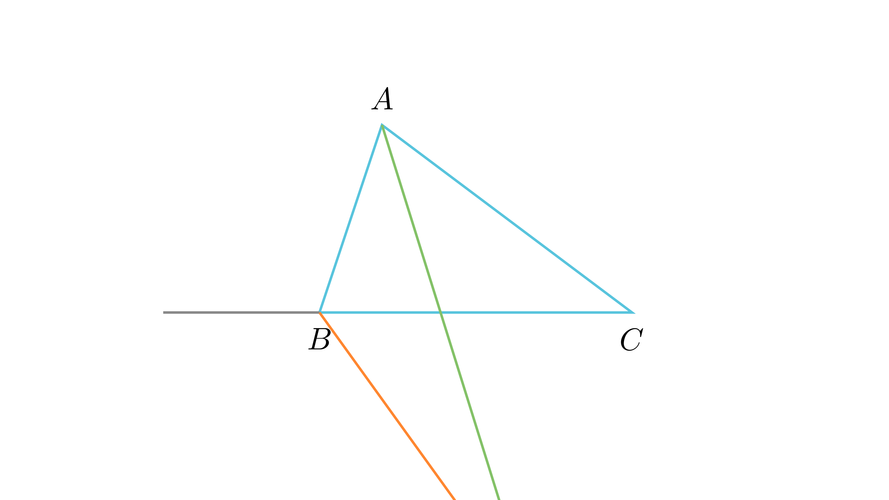

# Агол меѓу внатрешна и надворешна симетрала

## Текст на задачата
Во триаголникот $ABC$, нека $AY$ е симетрала на внатрешниот агол кај $A$, а $BY$ е симетрала на надворешниот агол кај $B$. Докажи дека тие се сечат под агол: $$\angle AYB = \frac{\gamma}{2}$$

## 📐 Скица / Конструкција
<Опис на цртежот. Кои се клучните точки? Дали има помошни линии?>

## 🧠 Анализа
Користи ја теоремата за надворешен агол во $\triangle ABY$.

## 📝 Решение (СИНТЕТИЧКО)
1. **Агли во $\triangle ABY$:** $\angle YAB = \frac{\alpha}{2}$. 
2. **Агол кај $B$:** Надворешниот агол кај $B$ во $\triangle ABC$ е $\alpha + \gamma$. Неговата половина е $\angle YBC = \frac{\alpha + \gamma}{2}$. 
3. **Надворешен агол во $\triangle ABY$:** Аголот $\angle YBC$ е надворешен за $\triangle ABY$, па $\angle YBC = \angle YAB + \angle AYB$. 
4. **Замена:** $\frac{\alpha + \gamma}{2} = \frac{\alpha}{2} + \angle AYB$. 
5. **Резултат:** $\angle AYB = \frac{\gamma}{2}$.

## ⚠️ Аналитички пристап (само ако е неизбежен)
<Ако мора да се користат координати, објасни зошто синтетичкиот пат е претежок.>

## 🏁 Заклучок
<Краен резултат.>