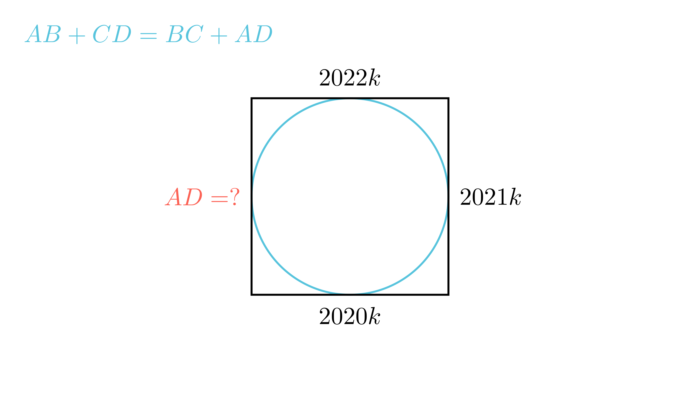

[⬅️ Назад кон Индексот](../../README.md) | [🧰 Skill: proportions](../../../tools/skill_guides/proportions.md)

# Тангентен четириаголник

## 📝 Текст на задачата
Во тангентниот четириаголник $ABCD$, со периметар $L = 40.42$ km, важи $AB : BC : CD = 2020 : 2021 : 2022$. Ако должината на најдолгата страна е $x$ m, пресметај колку е $x$.

## 📐 Скица

  

  

## 🧠 Анализа
**Зошто е оваа задача тешка?**
За тангентен четириаголник важи: Збирот на спротивните страни е еднаков. $AB + CD = BC + AD$. Ова значи дека секој пар спротивни страни носи половина од периметарот ($L/2$). Искористете го ова за да ја најдете четвртата страна $AD$ преку коефициентот $k$.

**Конструктивен потег:**
За тангентен четириаголник важи: Збирот на спротивните страни е еднаков. $AB + CD = BC + AD$. Ова значи дека секој пар спротивни страни носи половина од периметарот ($L/2$). Искористете го ова за да ја најдете четвртата страна $AD$ преку коефициентот $k$.

## 💡 Решение

??? tip "Чекор 1: Својство на тангентен четириаголник"
    $$ AB + CD = BC + AD = \frac{L}{2} $$

??? tip "Чекор 2: Изразување преку k"
    Нека $AB = 2020k, BC = 2021k, CD = 2022k$.
    Од својството:
    $$ 2020k + 2022k = 2021k + AD $$
    $$ 4042k = 2021k + AD $$
    $$ AD = 4042k - 2021k = 2021k $$

??? tip "Чекор 3: Наоѓање на k"
    Периметарот е збир на сите страни:
    $$ L = 4042k + 4042k = 8084k $$
    Дадено е $L = 40.42 \text{ km} = 40420 \text{ m}$.
    $$ 8084k = 40420 $$
    $$ k = \frac{40420}{8084} = 5 $$

??? tip "Чекор 4: Најдолга страна"
    Страните се: $2020k, 2021k, 2022k, 2021k$.
    Најдолга е $CD = 2022k$.
    $$ x = 2022 \cdot 5 = 10110 \text{ m} $$

## 🏁 Заклучок
Видете го решението погоре.

## 👩‍🏫 За наставници
Интересно е што $AD$ испадна еднаква на $BC$. Тоа значи дека четириаголникот е делтоид или рамнокрак трапез (ако е симетричен).