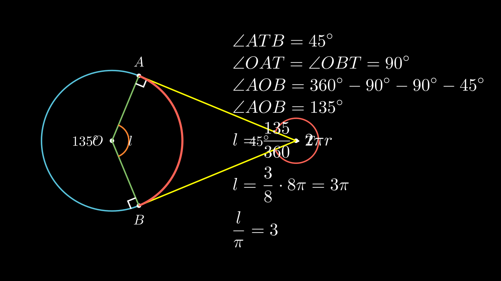

[⬅️ Назад кон Индексот](../README.md) | [🧰 Skill: angle_chasing](../../skill_guides/angle_chasing.md)

# Тангенти и кружен лак

## 📝 Текст на задачата
На кружница со радиус $r=4$ cm повлечени се тангенти од точка $T$. Аголот меѓу тангентите е $45^\circ$. Нека $l$ е должината на помалиот кружен лак меѓу допирните точки. Пресметај ја вредноста на $\frac{l}{\pi}$.

## 📐 Скица

{ width=500 }
## 🧠 Анализа
**Зошто е оваа задача тешка?**
Аголот меѓу тангентите ($\alpha$) и централниот агол ($\beta$) над тој лак се суплементни (нивниот збир е $180^\circ$), бидејќи радиусите се нормални на тангентите. Значи $\beta = 180^\circ - 45^\circ = 135^\circ$. Потоа користете ја формулата за должина на лак.

**Конструктивен потег:**
Аголот меѓу тангентите ($\alpha$) и централниот агол ($\beta$) над тој лак се суплементни (нивниот збир е $180^\circ$), бидејќи радиусите се нормални на тангентите. Значи $\beta = 180^\circ - 45^\circ = 135^\circ$. Потоа користете ја формулата за должина на лак.

## 💡 Решение

Бидејќи $TA$ и $TB$ се тангенти на кружницата, радиусите во допирните точки се нормални на тангентите, т.е. $\angle OAT = \angle OBT = 90^\circ$.
Четириаголникот $OATB$ има збир на агли $360^\circ$, па затоа:
$$ \angle AOB = 360^\circ - (\angle OAT + \angle OBT + \angle ATB) = 360^\circ - (90^\circ + 90^\circ + 45^\circ) = 135^\circ $$

Должината на кружниот лак $l$ се пресметува по формулата:
$$ l = \frac{\alpha}{360^\circ} \cdot 2\pi r $$
каде $\alpha = 135^\circ$ и $r=4$.

Заменуваме:
$$ l = \frac{135^\circ}{360^\circ} \cdot 2\pi \cdot 4 $$
$$ l = \frac{3}{8} \cdot 8\pi = 3\pi $$

Бараната вредност е:
$$ \frac{l}{\pi} = \frac{3\pi}{\pi} = 3 $$

??? tip "Чекор 1: Централен агол"
    Четириаголникот формиран од центарот $O$, допирните точки $A, B$ и точката $T$ има два прави агли (кај $A$ и $B$).
    Збирот на аглите е $360^\circ$.
    $$ \angle AOB + 90^\circ + 90^\circ + 45^\circ = 360^\circ $$
    $$ \angle AOB = 180^\circ - 45^\circ = 135^\circ $$

??? tip "Чекор 2: Должина на лакот"
    Формула: $l = \frac{\alpha}{360^\circ} 2\pi r$.
    $$ l = \frac{135}{360} \cdot 2\pi \cdot 4 $$
    $$ l = \frac{3 \cdot 45}{8 \cdot 45} \cdot 8\pi $$
    $$ l = \frac{3}{8} \cdot 8\pi = 3\pi $$

??? tip "Чекор 3: Бараната вредност"
    $$ \frac{l}{\pi} = \frac{3\pi}{\pi} = 3 $$
    
    Одговор: 3.

## 🏁 Заклучок
Видете го решението погоре.

## 👩‍🏫 За наставници
Кратењето на дропката $135/360$ со 45 е клучен чекор за брзо решавање.