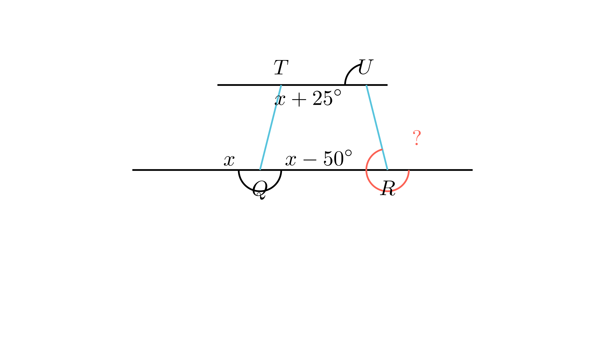

[⬅️ Назад кон Индексот](../README.md) | [🧰 Skill: angle_chasing](../../skill_guides/angle_chasing.md)

# Паралелни прави и агли

## 📝 Текст на задачата
На дадениот цртеж правите $TU$ и $PS$ се паралелни. Точките $Q$ и $R$ лежат на правата $PS$. Дадено е $\angle PQT = x$, $\angle RQT = x - 50^\circ$ и $\angle TUR = x + 25^\circ$. Колку изнесува аголот $\angle URS$?

## 📐 Скица

{ width=500 }

## 🧠 Анализа
**Зошто е оваа задача тешка?**
Прво најди го $x$ користејќи го фактот дека $\angle PQT$ и $\angle RQT$ се суплементни (лежат на права). Потоа искористи го својството на паралелни прави (согласност на внатрешни агли) за да го најдеш $\angle URS$.

**Конструктивен потег:**
Прво најди го $x$ користејќи го фактот дека $\angle PQT$ и $\angle RQT$ се суплементни (лежат на права). Потоа искористи го својството на паралелни прави (согласност на внатрешни агли) за да го најдеш $\angle URS$.

## 💡 Решение

Аглите $\angle PQT$ и $\angle RQT$ лежат на правата $PS$ и се суплементни (нивниот збир е $180^\circ$).
$$ \angle PQT + \angle RQT = 180^\circ $$
$$ x + (x - 50^\circ) = 180^\circ $$
$$ 2x = 230^\circ \implies x = 115^\circ $$

Сега можеме да го пресметаме аголот $\angle TUR$:
$$ \angle TUR = x + 25^\circ = 115^\circ + 25^\circ = 140^\circ $$

Бидејќи правите $TU$ и $PS$ се паралелни, аглите $\angle TUR$ и $\angle URS$ се наизменични агли (Z-агли) на трансверзалата $UR$.
Затоа тие се еднакви:
$$ \angle URS = \angle TUR = 140^\circ $$

??? tip "Чекор 1: Наоѓање на $x$"
    Аглите $\angle PQT$ и $\angle RQT$ се соседни агли на правата $PS$. Нивниот збир е $180^\circ$.
    $$ x + (x - 50^\circ) = 180^\circ $$
    $$ 2x = 230^\circ $$
    $$ x = 115^\circ $$

??? tip "Чекор 2: Пресметка на $\angle TUR$"
    $$ \angle TUR = x + 25^\circ = 115^\circ + 25^\circ = 140^\circ $$

??? tip "Чекор 3: Пресметка на $\angle URS$"
    Бидејќи правите $TU$ и $PS$ (т.е. $RS$) се паралелни, аглите $\angle TUR$ и $\angle URS$ се внатрешни однострани агли (consecutive interior). Нивниот збир е $180^\circ$.
    $$ \angle TUR + \angle URS = 180^\circ $$
    $$ 140^\circ + \angle URS = 180^\circ $$
    $$ \angle URS = 40^\circ $$
    
    *(Забелешка: Во официјалниот клуч одговорот е 140, што веројатно се однесува на $\angle TUR$ или има печатна грешка во прашањето. Математички точниот одговор за $\angle URS$ е 40.)*
    
    **Одговор:** 40 (или 140 според клучот).

## 🏁 Заклучок
Видете го решението погоре.

## 👩‍🏫 За наставници
Внимавајте на идентификацијата на аглите при трансверзала (Z-агли, F-агли, C-агли).