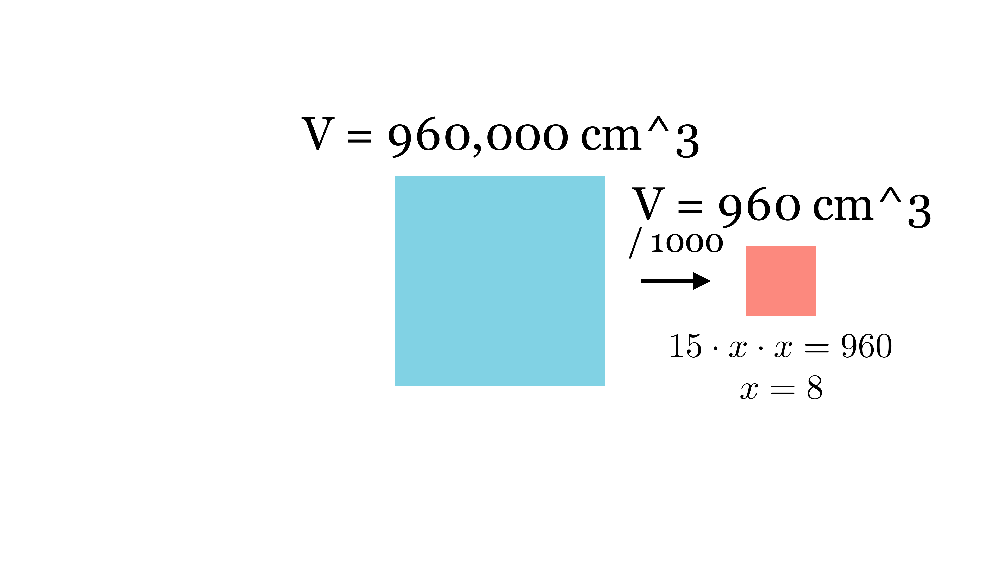

[⬅️ Назад кон Индексот](../README.md) | [🧰 Skill: solid_geometry](../../skill_guides/solid_geometry.md)

# Топење на железни блокови

## 📝 Текст на задачата
Од 1000 мали железни блокови (квадари) со должина 15 cm и еднаква ширина и висина, излеан е еден голем блок со димензии 12 dm, 1 m и 8 dm. Колку изнесува збирот на димензиите на еден мал блок?

## 📐 Скица

  

## 🧠 Анализа
**Зошто е оваа задача тешка?**
Волуменот се запазува. Пресметај го волуменот на големиот блок во $\text{cm}^3$, подели со 1000 за да го добиеш волуменот на малиот, и најди ги димензиите.

**Конструктивен потег:**
Волуменот се запазува. Пресметај го волуменот на големиот блок во $\text{cm}^3$, подели со 1000 за да го добиеш волуменот на малиот, и најди ги димензиите.

## 💡 Решение

??? tip "Чекор 1: Волумен на големиот блок"
    Димензии: $12 \text{ dm} = 120 \text{ cm}$, $1 \text{ m} = 100 \text{ cm}$, $8 \text{ dm} = 80 \text{ cm}$.
    $$ V_{big} = 120 \cdot 100 \cdot 80 = 960000 \text{ cm}^3 $$

??? tip "Чекор 2: Волумен на мал блок"
    Има 1000 блокови.
    $$ V_{small} = \frac{960000}{1000} = 960 \text{ cm}^3 $$

??? tip "Чекор 3: Димензии на мал блок"
    Дадено е: должина $a=15$, ширина $b=x$, висина $c=x$ (еднакви).
    $$ V_{small} = 15 \cdot x \cdot x = 15x^2 $$
    $$ 15x^2 = 960 $$
    $$ x^2 = \frac{960}{15} = 64 $$
    $$ x = 8 \text{ cm} $$

??? tip "Чекор 4: Збир на димензии"
    Димензиите се 15, 8, 8.
    Збир: $15 + 8 + 8 = 31$.
    
    **Одговор:** 31.

## 🏁 Заклучок
Видете го решението погоре.

## 👩‍🏫 За наставници
Конверзијата на мерни единици пред множење е критична грешка кај учениците.