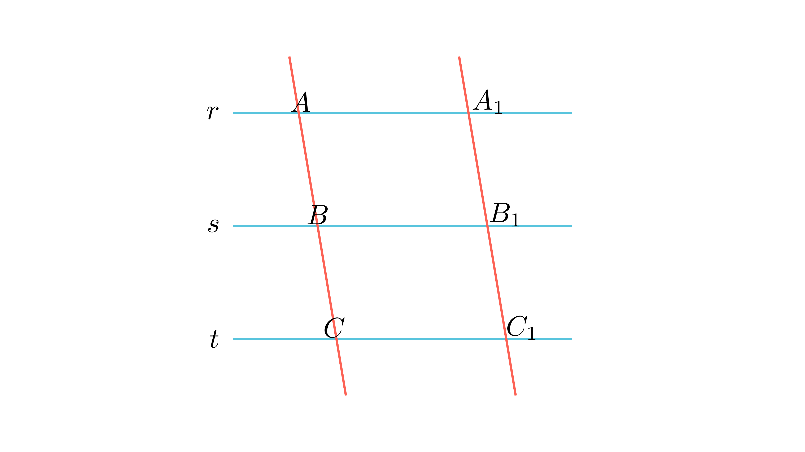

[⬅️ Назад кон Индексот](../README.md) | [🧰 Skill: similarity](../../skill_guides/similarity.md)

# Паралелни прави (Талес)

## 📝 Текст на задачата
Дадени се три паралелни прави $r, s, t$ (по тој редослед). Трите прави се пресечени со правите $m$ и $n$. Пресечните точки на $m$ се $A, B, C$, а на $n$ се $A_1, B_1, C_1$. Дадено е: $AB = 2x+3$, $BC = \frac{2y-1}{2}$, $A_1B_1 = y$, $B_1C_1 = \frac{x+2}{2}$. Ако $x+y=4$, одреди ја должината $AB$.

## 📐 Скица

{ width=500 }
## 🧠 Анализа
**Зошто е оваа задача тешка?**
Според Талесова теорема, отсечките на трансверзалите се пропорционални: $\frac{AB}{BC} = \frac{A_1B_1}{B_1C_1}$. Постави ја пропорцијата, искористи ја замената $y=4-x$ и реши ја равенката.

**Конструктивен потег:**
Според Талесова теорема, отсечките на трансверзалите се пропорционални: $\frac{AB}{BC} = \frac{A_1B_1}{B_1C_1}$. Постави ја пропорцијата, искористи ја замената $y=4-x$ и реши ја равенката.

## 💡 Решение

Според Талесовата теорема за пропорционални отсечки на трансверзали пресечени со паралелни прави, важи:
$$ \frac{AB}{BC} = \frac{A_1B_1}{B_1C_1} $$

Заменуваме со дадените изрази:
$$ \frac{2x+3}{\frac{2y-1}{2}} = \frac{y}{\frac{x+2}{2}} $$

Упростуваме (двојните дропки):
$$ \frac{2(2x+3)}{2y-1} = \frac{2y}{x+2} $$

Дадено е дека $x+y=4$, па $y=4-x$. Заменуваме во равенката:
$$ \frac{2(2x+3)}{2(4-x)-1} = \frac{2(4-x)}{x+2} $$
$$ \frac{4x+6}{8-2x-1} = \frac{8-2x}{x+2} $$
$$ \frac{4x+6}{7-2x} = \frac{8-2x}{x+2} $$

Множиме накрсно:
$$ (4x+6)(x+2) = (8-2x)(7-2x) $$
$$ 4x^2 + 8x + 6x + 12 = 56 - 16x - 14x + 4x^2 $$
$$ 4x^2 + 14x + 12 = 4x^2 - 30x + 56 $$
$$ 14x + 30x = 56 - 12 $$
$$ 44x = 44 \implies x = 1 $$

Сега ја пресметуваме должината на $AB$:
$$ AB = 2x+3 = 2(1)+3 = 5 $$
    $$ \frac{AB}{BC} = \frac{A_1B_1}{B_1C_1} $$
    $$ \frac{2x+3}{\frac{2y-1}{2}} = \frac{y}{\frac{x+2}{2}} $$
    Кратиме со 2 во именителите (или множиме со 2 горе):
    $$ \frac{2(2x+3)}{2y-1} = \frac{2y}{x+2} $$

??? tip "Чекор 2: Систем равенки"
    Дадено е $x+y=4 \implies y = 4-x$.
    Заменуваме во пропорцијата:
    $$ \frac{2(2x+3)}{2(4-x)-1} = \frac{2(4-x)}{x+2} $$
    $$ \frac{4x+6}{8-2x-1} = \frac{8-2x}{x+2} $$
    $$ \frac{4x+6}{7-2x} = \frac{8-2x}{x+2} $$

??? tip "Чекор 3: Решавање"
    Множиме вкрстено:
    $$ (4x+6)(x+2) = (7-2x)(8-2x) $$
    $$ 4x^2 + 8x + 6x + 12 = 56 - 14x - 16x + 4x^2 $$
    $$ 4x^2 + 14x + 12 = 4x^2 - 30x + 56 $$
    Поништуваме $4x^2$:
    $$ 14x + 30x = 56 - 12 $$
    $$ 44x = 44 \implies x = 1 $$

??? tip "Чекор 4: Пресметка на $AB$"
    $$ AB = 2x + 3 = 2(1) + 3 = 5 $$
    
    **Одговор:** 5.

## 🏁 Заклучок
Видете го решението погоре.

## 👩‍🏫 За наставници
Внимавајте на алгебарските манипулации при вкрстено множење.