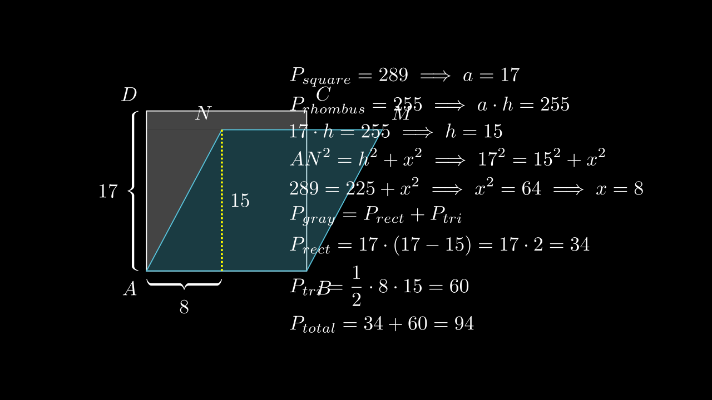

[⬅️ Назад кон Индексот](../README.md) | [🧰 Skill: area_method](../../skill_guides/area_method.md)

# Пресек на квадрат и ромб

## 📝 Текст на задачата
На сликата $ABCD$ е квадрат со плоштина $289 \text{ cm}^2$, а четириаголникот $ABMN$ е ромб со плоштина $255 \text{ cm}^2$. Колку изнесува плоштината на сивиот дел (делот од квадратот што не е покриен со ромбот)?

## 📐 Скица

{ width=500 }
## 🧠 Анализа
**Зошто е оваа задача тешка?**
Пресметај ја страната на квадратот. Таа е иста со страната на ромбот. Најди ја висината на ромбот. Пресекот на двете фигури е трапез. Сивиот дел е разликата меѓу плоштината на квадратот и плоштината на пресекот.

**Конструктивен потег:**
Пресметај ја страната на квадратот. Таа е иста со страната на ромбот. Најди ја висината на ромбот. Пресекот на двете фигури е трапез. Сивиот дел е разликата меѓу плоштината на квадратот и плоштината на пресекот.

## 💡 Решение

Плоштината на квадратот е $P_{kv} = a^2 = 289$, од каде страната на квадратот е $a = \sqrt{289} = 17 \text{ cm}$.
Ромбот има иста страна $a=17$ (бидејќи ја дели страната $AB$ со квадратот).
Плоштината на ромбот е $P_{romb} = a \cdot h = 255$.
Од тука ја наоѓаме висината на ромбот:
$$ 17 \cdot h = 255 \implies h = \frac{255}{17} = 15 \text{ cm} $$

Нека $N$ е темето на ромбот што лежи на левата страна. Проекцијата на $N$ врз $AB$ нека е $N'$. Триаголникот $AN N'$ е правоаголен со хипотенуза $AN=17$ и катета $NN'=h=15$.
Другата катета $AN'$ (хоризонталното поместување) е:
$$ x = \sqrt{17^2 - 15^2} = \sqrt{289 - 225} = \sqrt{64} = 8 \text{ cm} $$

Сивиот дел (делот од квадратот што не е покриен со ромбот) се состои од два дела:
1. Правоаголник над ромбот со висина $17 - 15 = 2 \text{ cm}$ и ширина $17 \text{ cm}$.
   $$ P_1 = 17 \cdot 2 = 34 \text{ cm}^2 $$
2. Правоаголен триаголник лево од ромбот (триаголникот $AN N'$ пресликан горе, или едноставно делот што останува).
   Всушност, ромбот "сече" дел од квадратот. Делот од квадратот што е *внатре* во ромбот е трапез со висина 15 и основи 17 и $17-8=9$.
   Плоштината на пресекот е $P_{presek} = \frac{17+9}{2} \cdot 15 = 13 \cdot 15 = 195 \text{ cm}^2$.

Бараната плоштина е разликата меѓу плоштината на квадратот и плоштината на пресекот:
$$ P_{siv} = P_{kv} - P_{presek} = 289 - 195 = 94 \text{ cm}^2 $$

Алтернативно, како збир на правоаголникот и триаголникот:
$$ P_{siv} = P_1 + P_{\triangle} = 34 + \frac{1}{2} \cdot 8 \cdot 15 = 34 + 60 = 94 \text{ cm}^2 $$
    Плоштина на квадрат $P_{sq} = a^2 = 289 \implies a = 17$ cm.
    Ромбот $ABMN$ ја има истата страна $AB=a=17$.
    Плоштина на ромб $P_{rh} = a \cdot h = 255$.
    $$ 17 \cdot h = 255 \implies h = \frac{255}{17} = 15 \text{ cm} $$

??? tip "Чекор 2: Геометрија на пресекот"
    Ромбот е 'навален'. Неговата висина е 15, а висината на квадратот е 17. Значи ромбот е целосно содржан во лентата помеѓу правите $AB$ и $CD$ (бидејќи $15 < 17$).
    Пресекот на ромбот и квадратот е делот од ромбот што е внатре во квадратот.
    Бидејќи висината на ромбот е помала од страната на квадратот, и ромбот почнува од истата основа $AB$, целиот ромб е внатре во квадратот? Не, тој е навален настрана.
    
    Ајде да ги најдеме координатите на $M$ и $N$.
    $A(0,0), B(17,0)$.
    Висината на $M$ е 15. Проекцијата $x$ се наоѓа со Питагора: $x^2 + 15^2 = 17^2 \implies x^2 = 289 - 225 = 64 \implies x = 8$.
    Значи $M(8, 15)$ (ако е навален кон $D$) или $M(25, 15)$ (ако е кон $C$).
    Бидејќи е ромб $ABMN$, $N$ е десно од $M$. $N = M + (17,0)$.
    Ако $M(8,15)$, тогаш $N(25,15)$.
    Квадратот е $x \in [0,17]$.
    Точките на ромбот се $A(0,0), B(17,0), N(25,15), M(8,15)$.
    Пресекот е многуаголник. Делот од ромбот што е НАДВОР од квадратот е триаголник?
    Правата $BC$ е $x=17$. Правата $BN$ поврзува $(17,0)$ и $(25,15)$.
    Таа е $y = \frac{15}{8}(x-17)$. За $x > 17$, $y > 0$. Значи целиот триаголник $BCK$ (каде $K$ е пресек) е надвор.
    Чекај, задачата бара 'сивиот дел'. Обично тоа е делот од квадратот што НЕ Е покриен.
    
    Плоштината на пресекот (заедничкиот дел) е:
    Тоа е трапез со темиња $A(0,0), B(17,0), P(17, 15), M(8,15)$.
    Основи: $AB=17$, $MP = 17-8=9$. Висина 15.
    $P_{int} = \frac{17+9}{2} \cdot 15 = 13 \cdot 15 = 195$.
    
    Сивиот дел (во квадратот, а не во ромбот) е:
    $$ P_{gray} = P_{sq} - P_{int} = 289 - 195 = 94 $$
    
    **Одговор:** 94.

## 🏁 Заклучок
Видете го решението погоре.

## 👩‍🏫 За наставници
Клучот е да се сфати дека пресекот е трапез.