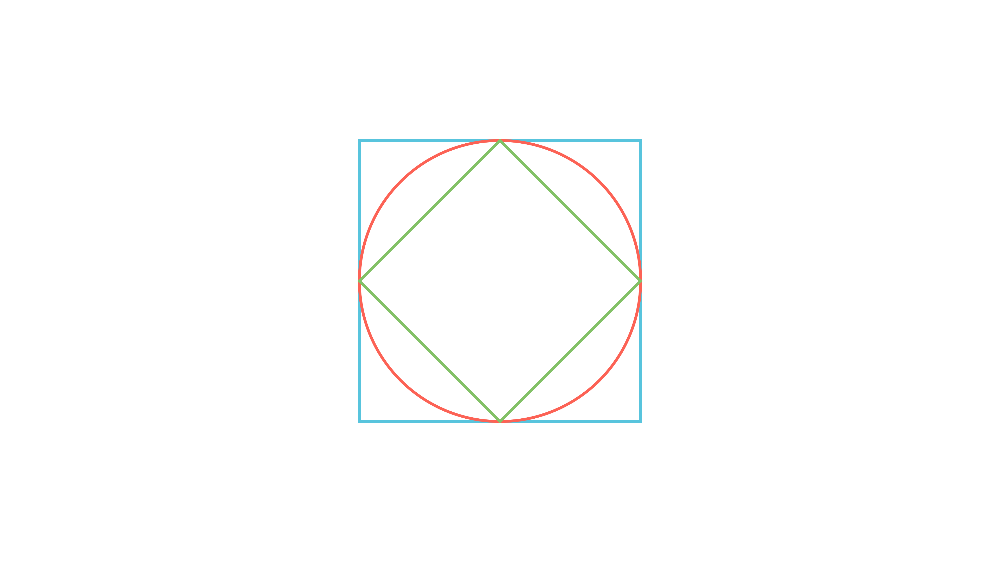

[⬅️ Назад кон Индексот](../../README.md) | [🧰 Skill: area_method](../../../tools/skill_guides/area_method.md)

# Плоштина во квадрат

## 📝 Текст на задачата
Даден е квадрат $ABCD$ со страна $4\sqrt{2}$. Во него е впишан четириаголникот $A_1B_1C_1D_1$ така што темињата се средини на страните на $ABCD$. Плоштината на делот од впишаниот круг во квадратот $ABCD$ што се наоѓа надвор од четириаголникот $A_1B_1C_1D_1$ претстави ја во облик $x + y\pi$. Колку изнесува $|x+y|$?

## 📐 Скица

  

## 🧠 Анализа
**Зошто е оваа задача тешка?**
Впишаниот круг во $ABCD$ има радиус $R = a/2$. Четириаголникот од средините е исто така квадрат (свртен). Пресметај ги плоштините и одземи ги.

**Конструктивен потег:**
Впишаниот круг во $ABCD$ има радиус $R = a/2$. Четириаголникот од средините е исто така квадрат (свртен). Пресметај ги плоштините и одземи ги.

## 💡 Решение

??? tip "Чекор 1: Димензии"
    Страна на големиот квадрат $a = 4\sqrt{2}$.
    Радиус на впишаниот круг во $ABCD$: $R = \frac{a}{2} = 2\sqrt{2}$.

??? tip "Чекор 2: Внатрешен четириаголник"
    Темињата се средини на страните. Ова е квадрат $A_1B_1C_1D_1$ (свртен за 45 степени).
    Неговата дијагонала е еднаква на страната на големиот квадрат $d_{small} = a = 4\sqrt{2}$.
    Плоштината на овој квадрат е:
    $$ P_{quad} = \frac{d^2}{2} = \frac{(4\sqrt{2})^2}{2} = \frac{32}{2} = 16 $$
    (Алтернативно: страна $b = \sqrt{(2\sqrt{2})^2 + (2\sqrt{2})^2} = \sqrt{8+8} = 4$. $P=4^2=16$).

??? tip "Чекор 3: Плоштина на кругот"
    $$ P_{circle} = R^2\pi = (2\sqrt{2})^2\pi = 8\pi $$

??? tip "Чекор 4: Барана плоштина"
    Се бара делот од кругот што е *надвор* од внатрешниот квадрат.
    Дали целиот внатрешен квадрат е во кругот? Дијагоналата му е $4\sqrt{2} \approx 5.6$. Дијаметарот на кругот е $4\sqrt{2}$.
    Значи темињата на внатрешниот квадрат лежат точно на кружницата. Квадратот е впишан во кругот.
    Бараната плоштина е разликата:
    $$ P = P_{circle} - P_{quad} = 8\pi - 16 $$

??? tip "Чекор 5: Вредност на изразот"
    Обликот е $x + y\pi$. Споредуваме со $-16 + 8\pi$.
    Значи $x = -16$ и $y = 8$.
    Бараме $|x+y| = |-16 + 8| = |-8| = 8$.
    
    **Одговор:** 8.

## 🏁 Заклучок
Видете го решението погоре.

## 👩‍🏫 За наставници
Важно е да се провери дали внатрешниот квадрат е навистина внатре во кругот (во овој случај е впишан).