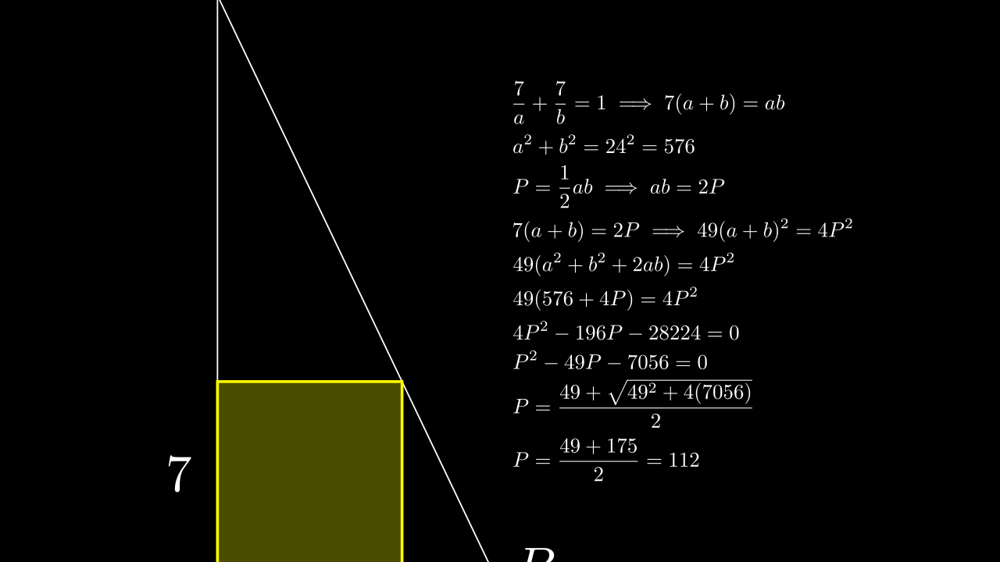

[⬅️ Назад кон Индексот](../README.md) | [🧰 Skill: similarity](../../skill_guides/similarity.md)

# Квадрат во правоаголен триаголник

## 📝 Текст на задачата
Во правоаголен триаголник со хипотенуза со должина 24, впишан е квадрат со страна 7, така што едното теме на квадратот се совпаѓа со темето на правиот агол на триаголникот. Колку е плоштината на правоаголниот триаголник?

## 📐 Скица

{ width=500 }
## 🧠 Анализа
**Зошто е оваа задача тешка?**
Нека катетите се $a$ и $b$. Квадратот со страна $x=7$ лежи во правиот агол. Врвот на квадратот лежи на хипотенузата. Користи сличност или координати. Условот за колинеарност е $\frac{x}{a} + \frac{x}{b} = 1$ или $x(a+b)=ab$.

**Конструктивен потег:**
Нека катетите се $a$ и $b$. Квадратот со страна $x=7$ лежи во правиот агол. Врвот на квадратот лежи на хипотенузата. Користи сличност или координати. Условот за колинеарност е $\frac{x}{a} + \frac{x}{b} = 1$ или $x(a+b)=ab$.

## 💡 Решение

Нека катетите на правоаголниот триаголник се $a$ и $b$, а хипотенузата е $c=24$.
Квадратот со страна $x=7$ е впишан така што темето на правиот агол се совпаѓа со темето $C$ на триаголникот.
Темињата на квадратот лежат на катетите, а четвртото теме лежи на хипотенузата.
Од сличност на триаголници (или од равенката на правата што ја содржи хипотенузата), важи релацијата:
$$ \frac{x}{a} + \frac{x}{b} = 1 $$
Заменувајќи $x=7$:
$$ \frac{7}{a} + \frac{7}{b} = 1 \implies 7(a+b) = ab $$

Плоштината на триаголникот е $P = \frac{1}{2}ab$, па $ab = 2P$.
Заменуваме во горната равенка:
$$ 7(a+b) = 2P \implies a+b = \frac{2P}{7} $$

Од Питагоровата теорема имаме:
$$ a^2 + b^2 = c^2 = 24^2 = 576 $$
Користејќи го идентитетот $(a+b)^2 = a^2 + b^2 + 2ab$:
$$ (\frac{2P}{7})^2 = 576 + 2(2P) $$
$$ \frac{4P^2}{49} = 576 + 4P $$
Множиме со 49:
$$ 4P^2 = 49(576) + 49(4P) $$
$$ 4P^2 - 196P - 28224 = 0 $$
Делиме со 4:
$$ P^2 - 49P - 7056 = 0 $$

Решаваме квадратна равенка по $P$:
$$ P = \frac{49 \pm \sqrt{(-49)^2 - 4(1)(-7056)}}{2} $$
$$ P = \frac{49 \pm \sqrt{2401 + 28224}}{2} $$
$$ P = \frac{49 \pm \sqrt{30625}}{2} $$
$$ P = \frac{49 \pm 175}{2} $$
Бидејќи плоштината мора да е позитивна:
$$ P = \frac{49 + 175}{2} = \frac{224}{2} = 112 $$

Плоштината на триаголникот е 112.
    Нека катетите се $a$ и $b$. Хипотенузата е $c=24$.
    Квадратот има страна $x=7$ и го дели правиот агол.
    Врвот на квадратот $(7,7)$ лежи на хипотенузата (правата низ $(a,0)$ и $(0,b)$).
    Равенка на права: $\frac{X}{a} + \frac{Y}{b} = 1$.
    Заменуваме $(7,7)$:
    $$ \frac{7}{a} + \frac{7}{b} = 1 \implies 7(a+b) = ab $$
    
    Плоштината на триаголникот е $P = \frac{ab}{2}$. Значи $ab = 2P$.
    Тогаш $7(a+b) = 2P \implies a+b = \frac{2P}{7}$.
    
    Од Питагорова теорема:
    $$ a^2 + b^2 = c^2 = 24^2 = 576 $$
    Знаеме дека $(a+b)^2 = a^2 + b^2 + 2ab$.
    Заменуваме:
    $$ \left(\frac{2P}{7}\right)^2 = 576 + 2(2P) $$
    $$ \frac{4P^2}{49} = 576 + 4P $$
    Делиме со 4:
    $$ \frac{P^2}{49} = 144 + P $$
    $$ P^2 = 49(144 + P) $$
    $$ P^2 - 49P - 7056 = 0 $$
    
    Решаваме квадратна равенка за $P$:
    $D = (-49)^2 - 4(1)(-7056) = 2401 + 28224 = 30625$.
    $\sqrt{D} = \sqrt{30625} = 175$.
    $$ P = \frac{49 \pm 175}{2} $$
    Позитивното решение е:
    $$ P = \frac{224}{2} = 112 $$
    
    **Одговор:** 112.

## 🏁 Заклучок
Видете го решението погоре.

## 👩‍🏫 За наставници
Врската $\frac{1}{a} + \frac{1}{b} = \frac{1}{x}$ е стандардна за квадрат впишан во прав агол.