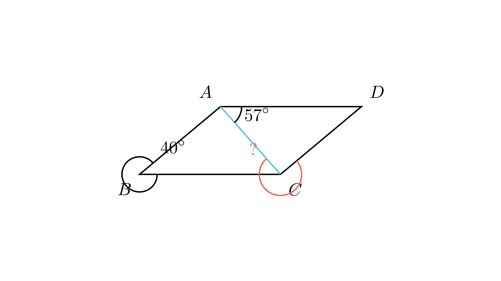

[⬅️ Назад кон Индексот](../README.md) | [🧰 Skill: angle_chasing](../../skill_guides/angle_chasing.md)

# Агол во паралелограм

## 📝 Текст на задачата
Колку степени изнесува аголот означен со прашалник на сликата, ако четириаголникот $BADC$ е паралелограм? (Дадено: $\angle B = 40^\circ$, $\angle CAD = 57^\circ$, се бара $\angle ACD$).

## 📐 Скица

{ width=500 }

## 🧠 Анализа
**Зошто е оваа задача тешка?**
Внимавај на редоследот на темињата: $BADC$ е паралелограм. Тоа значи $BA \parallel CD$ и $BC \parallel AD$. Искористи го својството на соседни агли во паралелограм (збир $180^\circ$) и наизменични агли.

**Конструктивен потег:**
Внимавај на редоследот на темињата: $BADC$ е паралелограм. Тоа значи $BA \parallel CD$ и $BC \parallel AD$. Искористи го својството на соседни агли во паралелограм (збир $180^\circ$) и наизменични агли.

## 💡 Решение

??? tip "Чекор 1: Својства на паралелограм $BADC$"
    Бидејќи $BADC$ е паралелограм, соседните агли имаат збир $180^\circ$.
    Дадено е $\angle B = 40^\circ$.
    Тогаш $\angle BAD = 180^\circ - 40^\circ = 140^\circ$.

??? tip "Чекор 2: Пресметка на $\angle BAC$"
    Аголот $\angle BAD$ е составен од $\angle BAC$ и $\angle CAD$.
    $$ \angle BAD = \angle BAC + \angle CAD $$
    $$ 140^\circ = \angle BAC + 57^\circ $$
    $$ \angle BAC = 140^\circ - 57^\circ = 83^\circ $$

??? tip "Чекор 3: Наизменични агли"
    Бидејќи $AB \parallel CD$ (страни на паралелограм) и $AC$ е трансверзала, аглите $\angle BAC$ и $\angle ACD$ се наизменични и еднакви.
    $$ \angle ACD = \angle BAC $$
    $$ \angle ACD = 83^\circ $$
    
    **Одговор:** 83.

## 🏁 Заклучок
Видете го решението погоре.

## 👩‍🏫 За наставници
Најчеста грешка е погрешно читање на името на паралелограмот. $BADC$ значи дека страните се $BA, AD, DC, CB$.