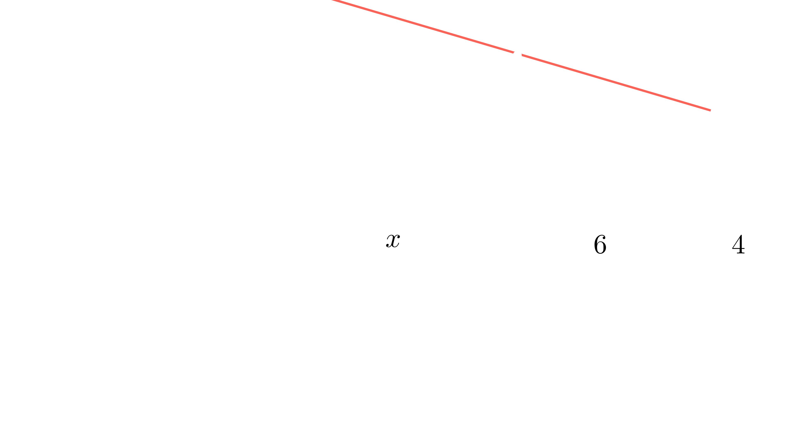

[⬅️ Назад кон Индексот](../../README.md) | [🧰 Skill: similarity](../../../tools/skill_guides/similarity.md)

# Колинеарни квадрати

## 📝 Текст на задачата
Три квадрати со различна големина се поставени еден до друг на права линија (како на сликата). Нивните горни леви темиња $X, Y, Z$ се колинеарни (лежат на иста права). Ако страните на двата помали квадрати се 6 cm и 4 cm, одреди ја страната на најголемиот квадрат.

## 📐 Скица
<!-- Ова место е резервирано за автоматската слика од Manim -->

  

  

## 🧠 Анализа
**Зошто е оваа задача тешка?**
Постави ги квадратите во координатен систем. Врвовите лежат на иста права, што значи дека наклонот (кофициентот на правец) помеѓу $X$ и $Y$ е ист како помеѓу $Y$ и $Z$.

**Конструктивен потег:**
Постави ги квадратите во координатен систем. Врвовите лежат на иста права, што значи дека наклонот (кофициентот на правец) помеѓу $X$ и $Y$ е ист како помеѓу $Y$ и $Z$.

## 💡 Решение

## 💡 Решение

??? success "👀 Прикажи го решението"
    Нека страната на најголемиот квадрат е $x$. Страните на другите два се 6 и 4.
    Поставуваме координатен систем каде долните страни лежат на $x$-оската.
    
    1. **Координати на темињата:**
       - Прв квадрат (страна $x$): Почнува од $x=0$. Темето $X$ е горе лево: $X(0, x)$.
       - Втор квадрат (страна 6): Почнува од $x=x$. Темето $Y$ е горе лево: $Y(x, 6)$.
       - Трет квадрат (страна 4): Почнува од $x=x+6$. Темето $Z$ е горе лево: $Z(x+6, 4)$.
    
    2. **Услов за колинеарност:**
       Наклонот на правата $XY$ мора да биде еднаков на наклонот на правата $YZ$.
       $$ m_{XY} = \frac{6 - x}{x - 0} = \frac{6-x}{x} $$
       $$ m_{YZ} = \frac{4 - 6}{(x+6) - x} = \frac{-2}{6} = -\frac{1}{3} $$
    
    3. **Решавање на равенката:**
       $$ \frac{6-x}{x} = -\frac{1}{3} $$
       $$ 3(6-x) = -x $$
       $$ 18 - 3x = -x $$
       $$ 18 = 2x $$
       $$ x = 9 $$
    
    **Резултат:** Страната на најголемиот квадрат е **9 cm**.

## 🏁 Заклучок
Видете го решението погоре.

## 👩‍🏫 За наставници
Оваа задача може да се реши и со сличност на триаголници (разликата во висина врз хоризонталното растојание е константна).