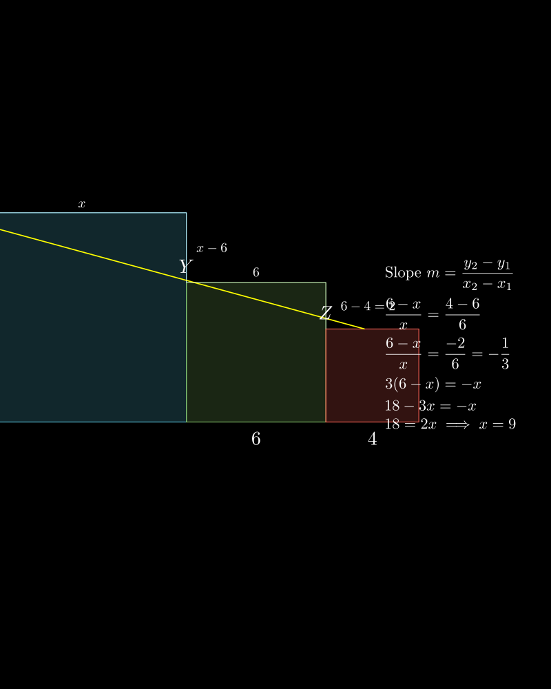

[⬅️ Назад кон Индексот](../README.md) | [🧰 Skill: similarity](../../skill_guides/similarity.md)

# Колинеарни квадрати

## 📝 Текст на задачата
Три квадрати со различна големина се поставени еден до друг на права линија (како на сликата). Нивните горни леви темиња $X, Y, Z$ се колинеарни (лежат на иста права). Ако страните на двата помали квадрати се 6 cm и 4 cm, одреди ја страната на најголемиот квадрат.

## 📐 Скица

{ width=500 }
## 🧠 Анализа
**Зошто е оваа задача тешка?**
Постави ги квадратите во координатен систем. Врвовите лежат на иста права, што значи дека наклонот (кофициентот на правец) помеѓу $X$ и $Y$ е ист како помеѓу $Y$ и $Z$.

**Конструктивен потег:**
Може да се искористи сличност на триаголници или аналитичка геометрија (наклон на права).

## 💡 Решение
Нека страната на најголемиот квадрат е $x$.
Страните на другите два квадрати се $6$ и $4$.
Бидејќи квадратите се поставени еден до друг на права линија, можеме да воведеме координатен систем.
Нека долното лево теме на најголемиот квадрат е во координатниот почеток $(0,0)$.

Тогаш координатите на горните леви темиња се:
*   $X(0, x)$ (за првиот квадрат со страна $x$)
*   $Y(x, 6)$ (за вториот квадрат со страна $6$, поместен за $x$ надесно)
*   $Z(x+6, 4)$ (за третиот квадрат со страна $4$, поместен за $x+6$ надесно)

Бидејќи точките $X, Y, Z$ се колинеарни (лежат на иста права), наклонот на отсечката $XY$ мора да биде еднаков на наклонот на отсечката $YZ$.

Наклонот $m$ се пресметува како $m = \frac{y_2 - y_1}{x_2 - x_1}$.

За $XY$:
$$ m_{XY} = \frac{6 - x}{x - 0} = \frac{6 - x}{x} $$

За $YZ$:
$$ m_{YZ} = \frac{4 - 6}{(x + 6) - x} = \frac{-2}{6} = -\frac{1}{3} $$

Ги изедначуваме наклоните:
$$ \frac{6 - x}{x} = -\frac{1}{3} $$

Множиме накрсно:
$$ 3(6 - x) = -1 \cdot x $$
$$ 18 - 3x = -x $$
$$ 18 = 2x $$
$$ x = 9 $$

Значи, страната на најголемиот квадрат е $9$ cm.

    Нека страната на најголемиот квадрат е $x$. Страните на другите два се 6 и 4.
    Поставуваме координатен систем каде долните страни лежат на $x$-оската.
    
    1. **Координати на темињата:**
       - Прв квадрат (страна $x$): Почнува од $x=0$. Темето $X$ е горе лево: $X(0, x)$.
       - Втор квадрат (страна 6): Почнува од $x=x$. Темето $Y$ е горе лево: $Y(x, 6)$.
       - Трет квадрат (страна 4): Почнува од $x=x+6$. Темето $Z$ е горе лево: $Z(x+6, 4)$.
    
    2. **Услов за колинеарност:**
       Наклонот на правата $XY$ мора да биде еднаков на наклонот на правата $YZ$.
       $$ m_{XY} = \frac{6 - x}{x - 0} = \frac{6-x}{x} $$
       $$ m_{YZ} = \frac{4 - 6}{(x+6) - x} = \frac{-2}{6} = -\frac{1}{3} $$
    
    3. **Решавање на равенката:**
       $$ \frac{6-x}{x} = -\frac{1}{3} $$
       $$ 3(6-x) = -x $$
       $$ 18 - 3x = -x $$
       $$ 18 = 2x $$
       $$ x = 9 $$
    
    **Резултат:** Страната на најголемиот квадрат е **9 cm**.

## 🏁 Заклучок
Видете го решението погоре.

## 👩‍🏫 За наставници
Оваа задача може да се реши и со сличност на триаголници (разликата во висина врз хоризонталното растојание е константна).