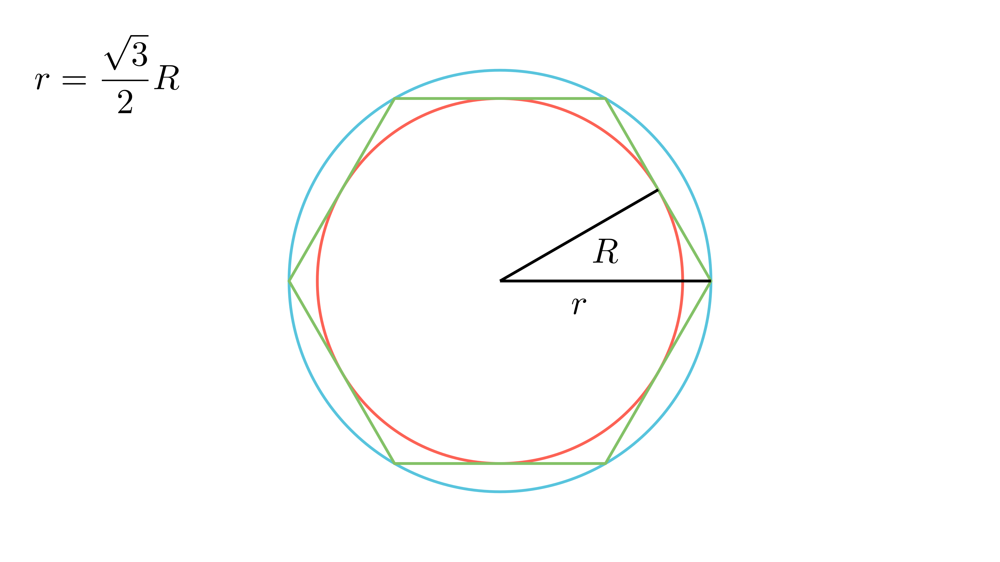

[⬅️ Назад кон Индексот](../../README.md) | [🧰 Skill: visual_reasoning](../../../tools/skill_guides/visual_reasoning.md)

# Концентрични кружници и квадрати

## 📝 Текст на задачата
Дадени се две концентрични кружници $K_1$ и $K_2$ со радиуси $R$ и $r$ ($R>r$). Околу поголемата е опишан квадрат, а во помалата е впишан квадрат. Односот на плоштините на кружниот прстен и квадратниот прстен (меѓу двата квадрати) е $\frac{\pi}{10}$.
а) Пресметај го односот на плоштините на помалиот и поголемиот круг.
б) Докажи дека постои правилен многуаголник за кој $K_1$ е опишана, а $K_2$ впишана кружница.

## 📐 Скица

> **👨‍💻 Geo-Mentor Code:**
> Одете во `assets/manim_code_log.md`, копирајте го кодот за `Task_2023_mun_g9_2` и генерирајте ја сликата.

> **👨‍💻 Geo-Mentor Code:**
> Одете во `assets/manim_code_log.md`, копирајте го кодот за `Task_2023_mun_g9_2` и генерирајте ја сликата.

## 🧠 Анализа
**Зошто е оваа задача тешка?**
Плоштината на кружниот прстен е $P_{kp} = \pi(R^2-r^2)$. За квадратниот прстен, треба да ги најдеме страните. Страната на опишаниот квадрат е $2R$. Страната на впишаниот квадрат (дијагонала $2r$) е $r\sqrt{2}$. Поставете ја равенката за односот и најдете врска меѓу $r$ и $R$.

**Конструктивен потег:**
Плоштината на кружниот прстен е $P_{kp} = \pi(R^2-r^2)$. За квадратниот прстен, треба да ги најдеме страните. Страната на опишаниот квадрат е $2R$. Страната на впишаниот квадрат (дијагонала $2r$) е $r\sqrt{2}$. Поставете ја равенката за односот и најдете врска меѓу $r$ и $R$.

## 💡 Решение

👀 Прикажи го решението

**Дел а) Однос на плоштини**
1.  Плоштина на кружен прстен: $P_{kp} = \pi R^2 - \pi r^2 = \pi(R^2 - r^2)$.
2.  Плоштина на квадратен прстен:
    *   Голем квадрат (опишан околу $R$): Страна $a_1 = 2R$. $P_1 = (2R)^2 = 4R^2$.
    *   Мал квадрат (впишан во $r$): Дијагонала $d = 2r$. Страна $a_2 = \frac{2r}{\sqrt{2}} = r\sqrt{2}$. $P_2 = (r\sqrt{2})^2 = 2r^2$.
    *   Разлика: $P_{kvp} = 4R^2 - 2r^2 = 2(2R^2 - r^2)$.

Равенка:
$$ \frac{\pi(R^2 - r^2)}{2(2R^2 - r^2)} = \frac{\pi}{10} $$
Кратиме $\pi$ и множиме вкрстено:
$$ 10(R^2 - r^2) = 2(2R^2 - r^2) $$
$$ 5R^2 - 5r^2 = 2R^2 - r^2 $$
$$ 3R^2 = 4r^2 \implies \frac{r^2}{R^2} = \frac{3}{4} $$

Односот на плоштините на круговите е $\frac{\pi r^2}{\pi R^2} = \frac{r^2}{R^2} = \frac{3}{4}$.

**Дел б) Правилен многуаголник**
Од $r^2/R^2 = 3/4$ следи $r = \frac{\sqrt{3}}{2}R$.
Во правилен $n$-аголник, врската меѓу радиусот на впишана ($r$) и опишана ($R$) кружница е $r = R \cos(\frac{180^\circ}{n})$.
Имаме $\cos(\frac{180^\circ}{n}) = \frac{\sqrt{3}}{2}$.
Ова значи $\frac{180^\circ}{n} = 30^\circ$, па $n = 6$.
Значи, постои таков многуаголник и тоа е **правилен шестаголник**.

## 🏁 Заклучок
<Краен резултат.>

## 👩‍🏫 За наставници
Врската $r = R \cos(180/n)$ е клучна за вториот дел. Учениците може да го препознаат ова и преку карактеристичниот триаголник на шестаголникот (рамностран).