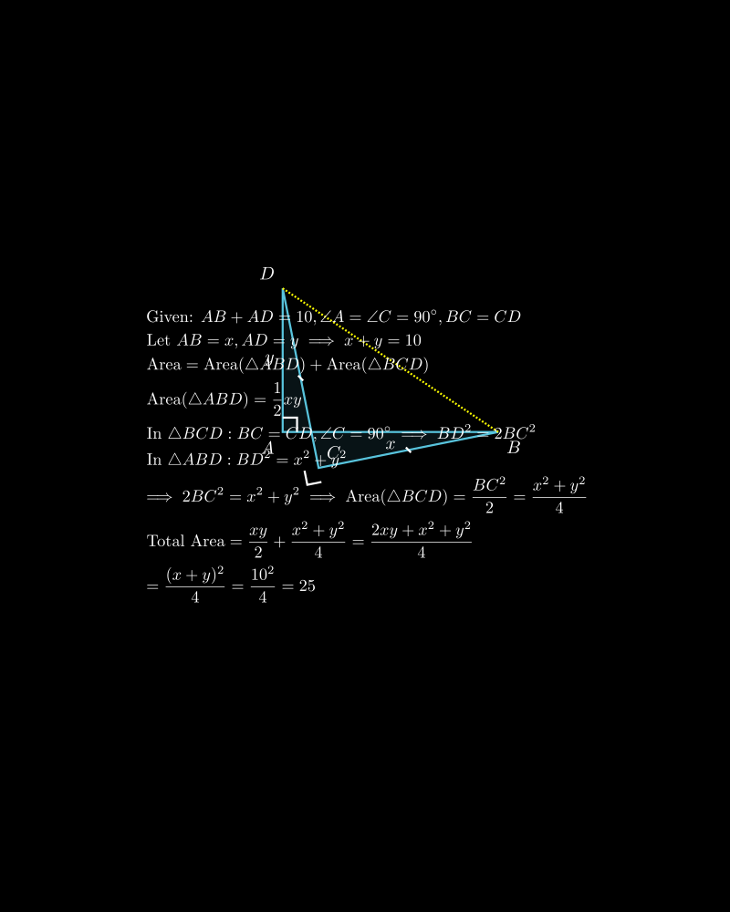

[⬅️ Назад кон Индексот](../README.md) | [🧰 Skill: algebraic_manipulation](../../skill_guides/algebraic_manipulation.md)

# Плоштина на четириаголник

## 📝 Текст на задачата
Даден е четириаголник $ABCD$ така што збирот на страните $AB$ и $AD$ е 10 cm, а аглите $\angle A$ и $\angle C$ се прави ($90^\circ$). Ако $BC = CD$, пресметај ја плоштината на четириаголникот.

## 📐 Скица

{ width=500 }
## 🧠 Анализа
**Зошто е оваа задача тешка?**
Повлечете ја дијагоналата $BD$. Таа ја дели фигурата на два правоаголни триаголници. Изразете ја хипотенузата $BD^2$ на два начина. Ова ќе ви даде врска меѓу страните. Плоштината е збир на плоштините на двата триаголници.

**Конструктивен потег:**
Повлечете ја дијагоналата $BD$. Таа ја дели фигурата на два правоаголни триаголници. Изразете ја хипотенузата $BD^2$ на два начина. Ова ќе ви даде врска меѓу страните. Плоштината е збир на плоштините на двата триаголници.

## 💡 Решение
Нека страните на четириаголникот се $AB=x$ и $AD=y$.
Дадено е дека $x+y=10$.
Нека $BC=CD=z$.

Повлекуваме дијагонала $BD$.
Четириаголникот е поделен на два правоаголни триаголници: $\triangle ABD$ (прав агол кај $A$) и $\triangle BCD$ (прав агол кај $C$).

1.  **Во $\triangle ABD$:**
    Според Питагоровата теорема:
    $$ BD^2 = AB^2 + AD^2 = x^2 + y^2 $$
    Плоштината е $P_{ABD} = \frac{1}{2} AB \cdot AD = \frac{1}{2}xy$.

2.  **Во $\triangle BCD$:**
    Според Питагоровата теорема:
    $$ BD^2 = BC^2 + CD^2 = z^2 + z^2 = 2z^2 $$
    Плоштината е $P_{BCD} = \frac{1}{2} BC \cdot CD = \frac{1}{2}z^2$.

3.  **Поврзување:**
    Бидејќи $BD^2$ е иста во двата случаи:
    $$ 2z^2 = x^2 + y^2 \implies z^2 = \frac{x^2 + y^2}{2} $$

4.  **Вкупна плоштина:**
    $$ P = P_{ABD} + P_{BCD} = \frac{1}{2}xy + \frac{1}{2}z^2 $$
    Заменуваме за $z^2$:
    $$ P = \frac{1}{2}xy + \frac{1}{2} \left( \frac{x^2 + y^2}{2} \right) $$
    $$ P = \frac{xy}{2} + \frac{x^2 + y^2}{4} $$
    Сведуваме на заеднички именител:
    $$ P = \frac{2xy + x^2 + y^2}{4} $$
    Броителот е полн квадрат:
    $$ P = \frac{(x+y)^2}{4} $$

5.  **Пресметка:**
    Дадено е $x+y=10$.
    $$ P = \frac{10^2}{4} = \frac{100}{4} = 25 \text{ cm}^2 $$

Конечниот резултат е $25 \text{ cm}^2$.