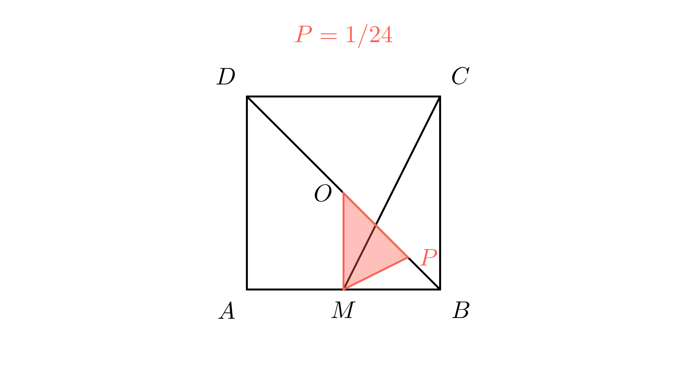

[⬅️ Назад кон Индексот](../README.md) | [🧰 Skill: coordinate_geometry](../../skill_guides/coordinate_geometry.md)

# Плоштина во квадрат

## 📝 Текст на задачата
Квадратот $ABCD$ има страна 1 m. Точката $M$ е средина на $AB$. Точката $O$ е центар на квадратот (пресек на дијагоналите). Нека $P$ е пресекот на отсечките $MC$ и $BD$. Пресметај ја плоштината на триаголникот $MOP$.

## 📐 Скица

{ width=500 }
## 🧠 Анализа
**Зошто е оваа задача тешка?**
Оваа задача може да се реши со сличност ($\,triangle MBP \sim \triangle CDP$), но најсигурен метод е **Аналитичка геометрија**. Поставете го квадратот во координатен систем: $A(0,0), B(1,0), C(1,1), D(0,1)$. Најдете ги равенките на правите $MC$ и $BD$, најдете го пресекот $P$, и потоа пресметајте ја плоштината на $\triangle MOP$ преку координати.

**Конструктивен потег:**
Оваа задача може да се реши со сличност ($\,triangle MBP \sim \triangle CDP$), но најсигурен метод е **Аналитичка геометрија**. Поставете го квадратот во координатен систем: $A(0,0), B(1,0), C(1,1), D(0,1)$. Најдете ги равенките на правите $MC$ и $BD$, најдете го пресекот $P$, и потоа пресметајте ја плоштината на $\triangle MOP$ преку координати.

## 💡 Решение

??? tip "Чекор 1: Равенки на правите"
    *   Права $BD$: Минува низ $(1,0)$ и $(0,1)$. Равенка: $y = -x + 1$.
    *   Права $MC$: Минува низ $M(0.5, 0)$ и $C(1,1)$.
        Наклон $k = \frac{1-0}{1-0.5} = \frac{1}{0.5} = 2$.
        Равенка: $y - 0 = 2(x - 0.5) \implies y = 2x - 1$.

??? tip "Чекор 2: Пресечна точка $P$"
    Решаваме систем:
    $$ 2x - 1 = -x + 1 $$
    $$ 3x = 2 \implies x = \frac{2}{3} $$
    $$ y = 2(\frac{2}{3}) - 1 = \frac{4}{3} - 1 = \frac{1}{3} $$
    Значи $P(\frac{2}{3}, \frac{1}{3})$.

??? tip "Чекор 3: Плоштина на $\triangle MOP$"
    Темињата се $M(0.5, 0)$, $O(0.5, 0.5)$, $P(\frac{2}{3}, \frac{1}{3})$.
    Основата $MO$ е вертикална отсечка со должина $0.5 - 0 = 0.5$.
    Висината од $P$ кон $MO$ е разликата во x-координатите:
    $$ h = x_P - x_M = \frac{2}{3} - \frac{1}{2} = \frac{4-3}{6} = \frac{1}{6} $$
    
    $$ P_{\triangle MOP} = \frac{1}{2} \cdot \text{основа} \cdot \text{висина} $$
    $$ P = \frac{1}{2} \cdot \frac{1}{2} \cdot \frac{1}{6} = \frac{1}{24} \text{ m}^2 $$

## 🏁 Заклучок
Видете го решението погоре.

## 👩‍🏫 За наставници
Аналитичката геометрија го претвора секој 'тежок' геометриски проблем во рутинска алгебра. Ова е моќна алатка за натпревари.