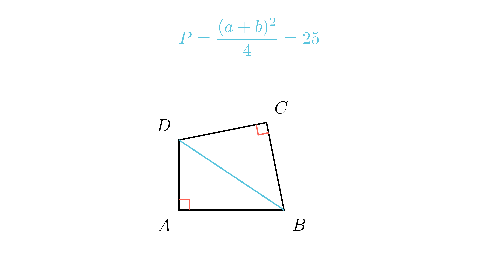

[⬅️ Назад кон Индексот](../../README.md) | [🧰 Skill: algebraic_manipulation](../../../tools/skill_guides/algebraic_manipulation.md)

# Плоштина на четириаголник

## 📝 Текст на задачата
Даден е четириаголник $ABCD$ таков што $\angle A = \angle C = 90^\circ$. Збирот на страните $AB + AD = 10$ cm, а страните $BC$ и $CD$ се еднакви ($BC=CD$). Пресметај ја плоштината на четириаголникот.

## 📐 Скица

  

## 🧠 Анализа
**Зошто е оваа задача тешка?**
Повлечете ја дијагоналата $BD$. Таа ја дели фигурата на два правоаголни триаголници. Изразете ја хипотенузата $BD^2$ на два начина (Питагора). Ова ќе ви даде врска меѓу страните. Плоштината е збир на плоштините на двата триаголници.

**Конструктивен потег:**
Повлечете ја дијагоналата $BD$. Таа ја дели фигурата на два правоаголни триаголници. Изразете ја хипотенузата $BD^2$ на два начина (Питагора). Ова ќе ви даде врска меѓу страните. Плоштината е збир на плоштините на двата триаголници.

## 💡 Решение

??? tip "Чекор 1: Ознаки"
    Нека $AB=a, AD=b$. Дадено е $a+b=10$.
    Нека $BC=CD=c$. Дијагоналата е $BD=d$.

??? tip "Чекор 2: Питагорова теорема"
    Од $\triangle ABD$ (прав агол кај A): $d^2 = a^2 + b^2$.
    Од $\triangle BCD$ (прав агол кај C): $d^2 = c^2 + c^2 = 2c^2$.
    Значи: $2c^2 = a^2 + b^2 \implies c^2 = \frac{a^2+b^2}{2}$.

??? tip "Чекор 3: Плоштина"
    $$ P = P_{ABD} + P_{BCD} = \frac{ab}{2} + \frac{c^2}{2} $$
    Заменуваме $c^2$:
    $$ P = \frac{ab}{2} + \frac{1}{2} \left( \frac{a^2+b^2}{2} \right) = \frac{2ab + a^2 + b^2}{4} $$

??? tip "Чекор 4: Препознавање на полн квадрат"
    Броителот е $(a+b)^2$!
    $$ P = \frac{(a+b)^2}{4} $$

??? tip "Чекор 5: Пресметка"
    Дадено е $a+b=10$.
    $$ P = \frac{10^2}{4} = \frac{100}{4} = 25 \text{ cm}^2 $$

## 🏁 Заклучок
Видете го решението погоре.

## 👩‍🏫 За наставници
Ова е прекрасна задача каде што не можеме да ги најдеме $a$ и $b$ поединечно, но можеме да ја најдеме плоштината преку нивниот збир.