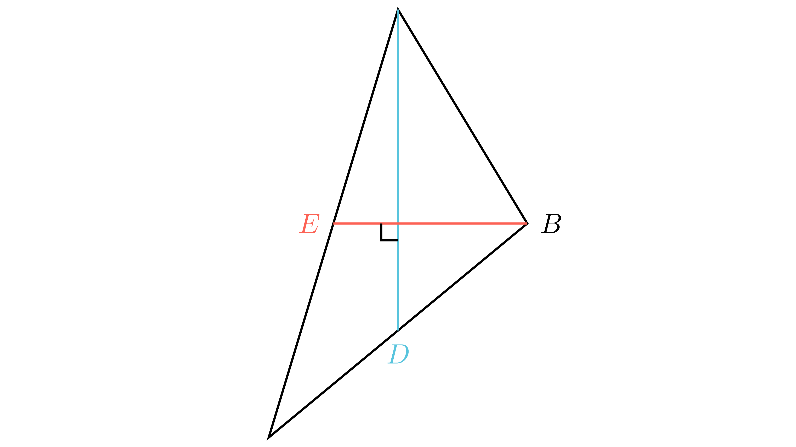

[⬅️ Назад кон Индексот](../../README.md) | [🧰 Skill: pythagorean_theorem](../../../tools/skill_guides/pythagorean_theorem.md)

# Тежишни линии во триаголник

## 📝 Текст на задачата
Во триаголникот $ABC$ тежишната линија $AD$ е нормална на тежишната линија $BE$. Ако $BC=6$ и $AC=8$, пресметај ја должината на страната $AB$.

## 📐 Скица
<!-- Ова место е резервирано за автоматската слика од Manim -->

  

  

## 🧠 Анализа
**Зошто е оваа задача тешка?**
Нека $T$ е тежиштето. Бидејќи $AD \perp BE$, триаголникот $ABT$ е правоаголен во $T$. Страните $AT$ и $BT$ се $2/3$ од тежишните линии $t_a$ и $t_b$. Искористете ја Питагоровата теорема во $\triangle ABT$ и својството на тежишните линии.

**Конструктивен потег:**
Нека $T$ е тежиштето. Бидејќи $AD \perp BE$, триаголникот $ABT$ е правоаголен во $T$. Страните $AT$ и $BT$ се $2/3$ од тежишните линии $t_a$ и $t_b$. Искористете ја Питагоровата теорема во $\triangle ABT$ и својството на тежишните линии.

## 💡 Решение

## 💡 Решение

??? tip "Чекор 1: Својство на тежиште"
    Тежишните линии се сечат во $T$ и се делат во однос 2:1.
    $AT = \frac{2}{3}t_a, TD = \frac{1}{3}t_a$.
    $BT = \frac{2}{3}t_b, TE = \frac{1}{3}t_b$.

??? tip "Чекор 2: Питагорова теорема во $\triangle ABT$"
    Бидејќи $AD \perp BE$, $\angle ATB = 90^\circ$.
    $$ AB^2 = AT^2 + BT^2 = \frac{4}{9}t_a^2 + \frac{4}{9}t_b^2 $$

??? tip "Чекор 3: Питагорова во другите триаголници"
    Во $\triangle ATE$ (прав агол во T): $AE^2 = AT^2 + TE^2 = \frac{4}{9}t_a^2 + \frac{1}{9}t_b^2$.
    Знаеме $AE = AC/2 = 4$. Значи $16 = \frac{4}{9}t_a^2 + \frac{1}{9}t_b^2$.
    
    Во $\triangle BTD$ (прав агол во T): $BD^2 = BT^2 + TD^2 = \frac{4}{9}t_b^2 + \frac{1}{9}t_a^2$.
    Знаеме $BD = BC/2 = 3$. Значи $9 = \frac{4}{9}t_b^2 + \frac{1}{9}t_a^2$.

??? tip "Чекор 4: Систем равенки"
    Нека $x = t_a^2/9$ и $y = t_b^2/9$.
    1. $4x + y = 16$
    2. $x + 4y = 9$
    
    Собираме: $5(x+y) = 25 \implies x+y = 5$.

??? tip "Чекор 5: Пресметка на $AB$"
    $AB^2 = 4x + 4y = 4(x+y) = 4 \cdot 5 = 20$.
    $AB = \sqrt{20} = 2\sqrt{5}$.

## 🏁 Заклучок
Видете го решението погоре.

## 👩‍🏫 За наставници
Оваа задача има и готова формула: $5c^2 = a^2 + b^2$ ако $t_a \perp t_b$. Учениците можат да ја изведат на лице место.