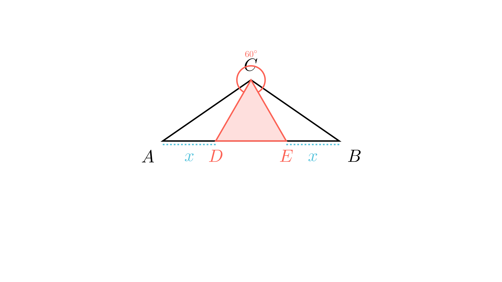

[⬅️ Назад кон Индексот](../README.md) | [🧰 Skill: logic](../../skill_guides/logic.md)

# Периметри во рамнокрак триаголник

## 📝 Текст на задачата
На основата $AB$ на рамнокракиот $\triangle ABC$ се избрани точки $D$ и $E$ (по редослед $A, D, E, B$) така што $AD = BE$ и $\angle DCE = 60^\circ$. Ако периметарот на $\triangle DEC$ е 30 cm, а збирот од периметрите на $\triangle ADC$ и $\triangle BCE$ е 60 cm, пресметај го периметарот на $\triangle ABC$.

## 📐 Скица
{ width=500 }
## 🧠 Анализа
**Зошто е оваа задача тешка?**
Искористете ја симетријата. Триаголниците $\triangle ADC$ и $\triangle BEC$ се складни (зошто?). Ова значи дека $CD = CE$. Бидејќи $\angle DCE = 60^\circ$, триаголникот $\triangle DEC$ е рамностран. Ова ви овозможува да ги најдете сите страни.

**Конструктивен потег:**
Искористете ја симетријата. Триаголниците $\triangle ADC$ и $\triangle BEC$ се складни (зошто?). Ова значи дека $CD = CE$. Бидејќи $\angle DCE = 60^\circ$, триаголникот $\triangle DEC$ е рамностран. Ова ви овозможува да ги најдете сите страни.

## 💡 Решение

??? tip "Чекор 1: Доказ за рамностран триаголник"
    Дадено е $AC = BC$ (рамнокрак) и $AD = BE$. Аглите на основата се еднакви ($\angle A = \angle B$).
    Според признакот САС, $\triangle ADC \cong \triangle BEC$.
    Од складноста следи $CD = CE$.
    Во $\triangle DEC$ имаме $CD=CE$ и агол од $60^\circ$ меѓу нив $\implies \triangle DEC$ е рамностран.

??? tip "Чекор 2: Пресметка на страните на $\triangle DEC$"
    Дадено е $L_{DEC} = 30$. Бидејќи е рамностран:
    
    $$ CD = DE = CE = \frac{30}{3} = 10 \text{ cm} $$

??? tip "Чекор 3: Врска меѓу периметрите"
    Дадено е $L_{ADC} + L_{BCE} = 60$.
    Поради складноста, $L_{ADC} = L_{BCE}$, па $2 L_{ADC} = 60 \implies L_{ADC} = 30$.
    Периметарот на $\triangle ADC$ е:
    
    $$ AC + AD + CD = 30 $$
    
    Заменуваме $CD=10$:
    
    $$ AC + AD = 20 $$

??? tip "Чекор 4: Периметар на $\triangle ABC$"
    $$ L_{ABC} = AC + BC + AB $$
    
    $$ L_{ABC} = AC + AC + (AD + DE + EB) $$
    
    Бидејќи $BE=AD$:
    
    $$ L_{ABC} = 2AC + 2AD + DE $$
    
    $$ L_{ABC} = 2(AC + AD) + DE $$
    
    Заменуваме $AC+AD=20$ и $DE=10$:
    
    $$ L_{ABC} = 2(20) + 10 = 40 + 10 = 50 \text{ cm} $$

## 🏁 Заклучок
Видете го решението погоре.

## 👩‍🏫 За наставници
Клучниот момент е да се воочи дека $AB$ не е само една отсечка, туку збир од $AD+DE+EB$. Групирањето на членовите ($2(AC+AD)$) го скратува решавањето.