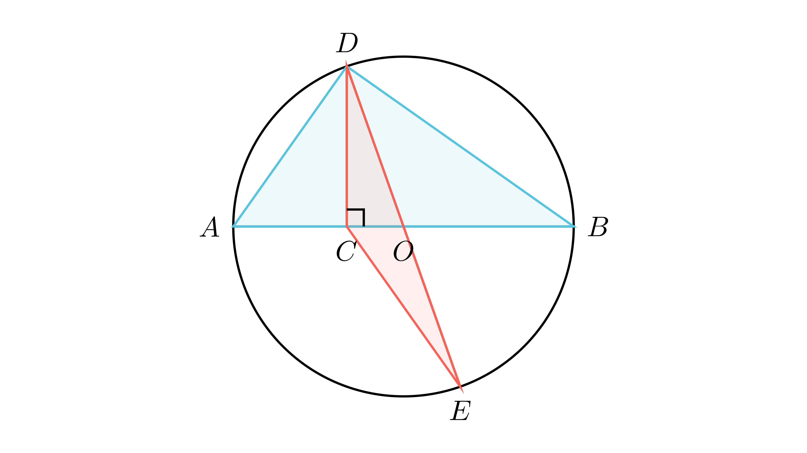

[⬅️ Назад кон Индексот](../../README.md) | [🧰 Skill: logic](../../../tools/skill_guides/logic.md)

# Однос на плоштини во кружница

## 📝 Текст на задачата
Нека $AB$ е дијаметар на кружница. Точката $C$ лежи на отсечката $AB$ при што важи $2AC = CB$. Точките $D$ и $E$ лежат на кружницата така што $DC \perp AB$ и $DE$ е дијаметар на кружницата. Пресметај го односот на плоштините $P_{ABD} : P_{CDE}$.

## 📐 Скица

> **👨‍💻 Geo-Mentor Code:**
> Одете во `assets/manim_code_log.md`, копирајте го кодот за `Task_2025_mun_y1_3ab` и генерирајте ја сликата.

## 🧠 Анализа
**Зошто е оваа задача тешка?**
Направете прецизна скица. Бидејќи $DE$ е дијаметар, центарот $O$ е средина на $DE$. Точката $C$ е фиксна ($AC = \frac{1}{3}AB$). Клучот е да се изразат плоштините преку радиусот $R$. Забележете дека $\triangle CDE$ и $\triangle ABD$ имаат врска со висината $DC$.

**Конструктивен потег:**
Направете прецизна скица. Бидејќи $DE$ е дијаметар, центарот $O$ е средина на $DE$. Точката $C$ е фиксна ($AC = \frac{1}{3}AB$). Клучот е да се изразат плоштините преку радиусот $R$. Забележете дека $\triangle CDE$ и $\triangle ABD$ имаат врска со висината $DC$.

## 💡 Решение

👀 Прикажи го решението

Нека $R$ е радиусот на кружницата, а $O$ е центарот. $AB = 2R$.

**Чекор 1: Лоцирање на точката C**
Дадено е $2AC = CB$ и $AC + CB = 2R$. 
Значи $3AC = 2R \implies AC = \frac{2}{3}R$. 
Бидејќи $O$ е средина на $AB$, растојанието $AO = R$. 
Тогаш $OC = AO - AC = R - \frac{2}{3}R = \frac{1}{3}R$.

**Чекор 2: Координати и висини (Синтетички пристап)**
Нека $h = DC$. Бидејќи $DC \perp AB$, $h$ е висина во $\triangle ABD$ кон страната $AB$.

$$ P_{ABD} = \frac{1}{2} \cdot AB \cdot DC = \frac{1}{2} (2R) h = R \cdot h $$

**Чекор 3: Плоштина на CDE**
Триаголникот $CDE$ има страна $DE = 2R$ (дијаметар). Висината од $C$ кон $DE$ е тешко да се најде директно. Полесно е да се воочи дека $O$ е средина на $DE$. 
Бидејќи $C, O, D$ не се колинеарни (освен ако $D$ е $A$ или $B$, што не е случај), ова е општ триаголник.

*Алтернативен пристап (преку проекции):*
Нека $F$ е подножјето на нормалата од $E$ кон $AB$. Бидејќи $O$ е средина на $DE$, $\triangle DCO \cong \triangle EFO$ (правоаголни, $DO=EO$, накрсни агли). 
Значи $EF = DC = h$ и $OF = OC = \frac{1}{3}R$.
Четириаголникот $DCEF$ е паралелограм ($DC || EF, DC=EF$). Дијагоналите се преполовуваат.
Плоштината на $\triangle CDE$ е половина од паралелограмот, или можеме да ја пресметаме како $P_{CDE} = P_{CDO} + P_{CEO}$.
Бидејќи $DO=EO$, $P_{CDO} = P_{CEO}$.
Во $\triangle CDO$, основата е $OC = R/3$, висината е $h$.

$$ P_{CDO} = \frac{1}{2} \cdot OC \cdot DC = \frac{1}{2} \cdot \frac{R}{3} \cdot h = \frac{Rh}{6} $$

$$ P_{CDE} = 2 \cdot P_{CDO} = \frac{Rh}{3} $$

**Чекор 4: Односот**

$$ \frac{P_{ABD}}{P_{CDE}} = \frac{Rh}{Rh/3} = 3 $$

Односот е 3:1.

## 🏁 Заклучок
<Краен резултат.>

## 👩‍🏫 За наставници
Симетријата е клучна. Точката $E$ е слика на $D$ при централна симетрија во однос на $O$. Ова веднаш ни кажува дека растојанието од $E$ до правата $AB$ е исто како од $D$ до $AB$.