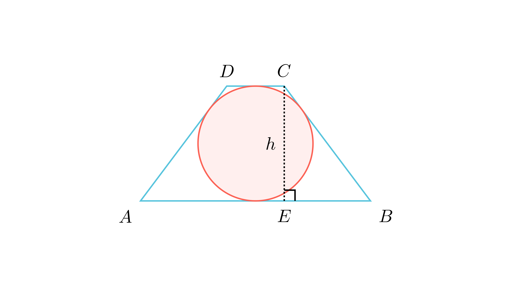

# Опишан рамнокрак трапез

## Текст на задачата
Нека $ABCD$ е рамнокрак трапез со $AB \parallel CD$ опишан околу кружница. Нека $CE$ е нормала спуштена од темето $C$ на страната $AB$. Докажи дека $CE$ е геометриска средина на отсечките $AB$ и $CD$.

## 📐 Скица / Конструкција
{ width=500 }
*(Тука скриптата автоматски ќе ја вметне сликата `assets/images/4427.png` ако постои)*

## 🧠 Анализа
Користи го својството на тангентен четириаголник: збирот на спротивните страни е еднаков ($AB + CD = AD + BC$). Бидејќи е рамнокрак, $AD=BC$. Ова ти овозможува да го изразиш кракот преку основите.

## 📝 Решение (СИНТЕТИЧКО)
Нека основите се $AB=a$ и $CD=b$, а кракот е $BC=c$. Висината е $CE=h$.
Треба да докажеме дека $h = \sqrt{ab}$.

### Чекор 1: Својство на опишан трапез
Бидејќи трапезот е опишан околу кружница (тангентен), збирот на спротивните страни е еднаков:
$$ AB + CD = AD + BC $$
Бидејќи е рамнокрак ($AD=BC=c$):
$$ a + b = 2c \implies c = \frac{a+b}{2} $$

### Чекор 2: Проекција на кракот
Во рамнокрак трапез, отсечката $EB$ (проекцијата на кракот врз основата) е:
$$ EB = \frac{a-b}{2} $$

### Чекор 3: Питагорова теорема
Во правоаголниот $\triangle CEB$:
$$ h^2 = c^2 - EB^2 $$
Заменуваме со изразите преку $a$ и $b$:
$$ h^2 = \left(\frac{a+b}{2}\right)^2 - \left(\frac{a-b}{2}\right)^2 $$

Користиме разлика на квадрати ($x^2 - y^2 = (x-y)(x+y)$):
$$ h^2 = \frac{1}{4} \left[ (a+b) - (a-b) \right] \cdot \left[ (a+b) + (a-b) \right] $$
$$ h^2 = \frac{1}{4} \cdot (2b) \cdot (2a) $$
$$ h^2 = \frac{4ab}{4} = ab $$

Значи $h = \sqrt{ab}$, што значи $CE$ е геометриска средина на основите.

## 🏁 Заклучок
Докажано е дека висината е геометриска средина на основите.