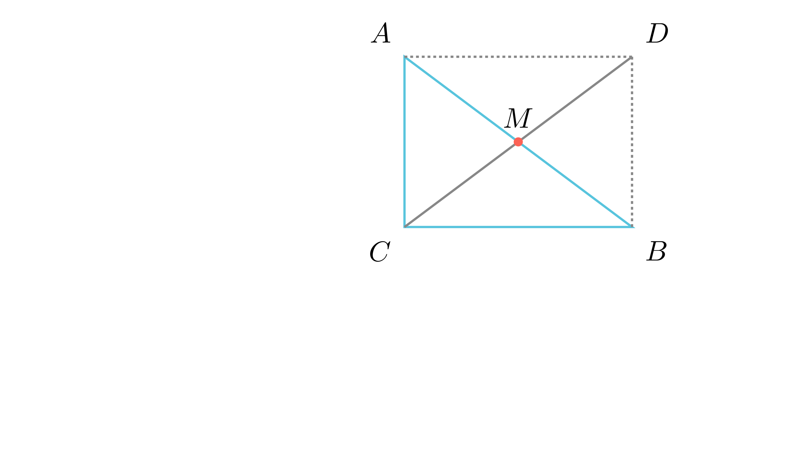

---
allowed_tools:
- classical_euclidean
- similarity
- symmetry
difficulty: 2
field: geometry
forbidden_tools:
- coordinate_geometry
- vectors
- complex_numbers
geometry_style: synthetic
grade: 9
language_original: <mk | en | sr | hr | ...>
primary_skill: <main_tool>
problem_id: Cnt92-1012_Prob8_Synthetic
related_skills:
- rectangles
- pythagorean_theorem
related_theorems:
- pythagorean_theorem
source: <натпревар / списание / година>
tags:
- geometry
- olympiad
translated: false
---

# Медијана кон хипотенуза (Синтетички пристап)

## Текст на задачата
Во правоаголен триаголник со катети 12 и 5, пресметај ја медијаната кон хипотенузата.

## 📐 Скица / Конструкција

{ width=500 }
## 🧠 Анализа
Замисли дека го дополнуваш триаголникот до правоаголник. Медијаната е половина од едната дијагонала. Што знаеме за дијагоналите во правоаголник?

## 📝 Решение (СИНТЕТИЧКО)
1. Со Питагорова теорема наоѓаме хипотенуза $c = \sqrt{5^2 + 12^2} = 13$.
2. **Синтетички доказ:** Ако го дополниме триаголникот до правоаголник, хипотенузата станува една дијагонала, а медијаната е половина од другата дијагонала. Бидејќи дијагоналите во правоаголник се еднакви и се преполовуваат, следи дека $m_c = c/2$.
3. $m_c = 6,5$.

## ⚠️ Аналитички пристап (само ако е неизбежен)
<Ако мора да се користат координати, објасни зошто синтетичкиот пат е претежок.>

## 🏁 Заклучок
Видете го решението погоре.