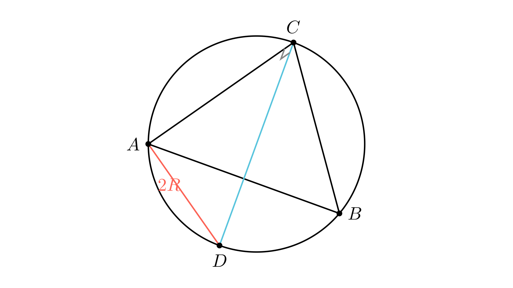

# Симетрали на агли и дијаметар на опишана кружница

# Текст на задачата
Даден е триаголник $ABC$. Нека точките $L$ и $M$ се пресеци на симетралите на внатрешниот и надворешниот агол при темето $C$ со правата $AB$, соодветно. Ако важи $CL = CM$, докажи дека:

$$AC^2 + BC^2 = 4R^2$$

каде $R$ е радиусот на опишаната кружница на $\triangle ABC$.

# 💡 Помош (Hints)

Кликни за мала помош

1. Размислете за аголот помеѓу внатрешната и надворешната симетрала на ист агол. Колку изнесува $\angle LCM$?

$$\angle LCM = 90^\circ$$

2. Користете го условот $CL = CM$ за да ги одредите аглите на $\triangle CML$. Што заклучувате за $\angle CLM$?

3. Изразете ги аглите $\alpha$ и $\beta$ преку $\gamma$. Дали може да докажете дека $\beta - \alpha = 90^\circ$?

4. Конструирајте точка $D$ на кружницата таква што $BC = CD$. Што ќе биде отсечката $AD$?

# Решение
## 🧠 Експертска Анализа (Интуиција)
Оваа задача на прв поглед изгледа како да бара пресметки со должини, но нејзината суштина е во **аголната конфигурација**. 

**Тригерот:** Штом се споменати внатрешна и надворешна симетрала на ист агол, веднаш знаеме дека тие се под агол од $90^\circ$. Зошто? Затоа што тие ги половат двата агли кои заедно чинат $180^\circ$. Дополнителниот услов $CL = CM$ го претвора $\triangle CML$ во рамнокрак правоаголен триаголник. Ова е исклучително силен услов кој ги „заклучува“ аглите на почетниот триаголник $\triangle ABC$.

**Стратегија:** Целта е да стигнеме до изразот $4R^2$, што е всушност $(2R)^2$. Ова не асоцира на Питагорова теорема во триаголник каде хипотенузата е дијаметар на кружницата. Значи, нашата задача е да најдеме или конструираме правоаголен триаголник чија хипотенуза е дијаметарот $2R$, а катетите се еднакви на $AC$ и $BC$. Клучот лежи во докажувањето дека $\beta - \alpha = 90^\circ$.

## 📐 Детално Решение

Чекор 1: Анализа на аглите околу темето C — формула: ∠LCM = 90°

Нека $\alpha, \beta, \gamma$ се внатрешните агли на $\triangle ABC$. Симетралите на внатрешниот и надворешниот агол при темето $C$ се заемно нормални бидејќи:

$$
\angle LCM = \frac{\gamma}{2} + \frac{180^\circ - \gamma}{2} = 90^\circ
$$

Бидејќи е дадено дека $CL = CM$, триаголникот $\triangle CML$ е рамнокрак правоаголен триаголник. Оттука следува:

$$
\angle CLM = \angle CML = 45^\circ
$$

Аголот $\angle CLM$ е надворешен за триаголникот $\triangle BLC$ (ако $B$ е помеѓу $A$ и $L$) или дел од него. Поточно, во $\triangle ALC$ имаме:

$$
\angle ALC = 180^\circ - \angle CLM = 135^\circ
$$

Збирот на аглите во $\triangle ALC$ е:

$$
\alpha + \frac{\gamma}{2} + 135^\circ = 180^\circ \implies \alpha + \frac{\gamma}{2} = 45^\circ
$$

Чекор 2: Врска помеѓу аглите алфа и бета — формула: β − α = 90°

Од претходниот чекор имаме $\frac{\gamma}{2} = 45^\circ - \alpha$. Знаеме дека $\gamma = 180^\circ - (\alpha + \beta)$, па:

$$
\frac{180^\circ - \alpha - \beta}{2} = 45^\circ - \alpha
$$
$$
90^\circ - \frac{\alpha}{2} - \frac{\beta}{2} = 45^\circ - \alpha
$$
$$
45^\circ + \frac{\alpha}{2} = \frac{\beta}{2} \implies \beta - \alpha = 90^\circ
$$

Ова е клучниот резултат. Триаголникот $ABC$ е таков што разликата на аглите кај основата е прав агол.

Чекор 3: Геометриска конструкција и Питагорова теорема — формула: ∠ACD = 90°

Нека $k$ е опишаната кружница околу $\triangle ABC$ со радиус $R$. Конструираме точка $D$ на кружницата $k$ таква што тетивите $BC$ и $CD$ се еднакви ($BC = CD$). 

- Аглите над еднакви тетиви се еднакви: $\angle CAD = \angle BAC = \alpha$? Не, аголот над тетивата $CD$ е $\angle CAD$, а над $BC$ е $\angle BAC = \alpha$. Значи $\angle CAD = \alpha$.
- Четириаголникот $ABCD$ е тетивен. Тогаш $\angle ADC = 180^\circ - \beta$ (спротивни агли).
- Во триаголникот $ACD$, збирот на аглите е $180^\circ$:

$$
\angle ACD = 180^\circ - (\angle CAD + \angle ADC) = 180^\circ - (\alpha + 180^\circ - \beta) = \beta - \alpha
$$

Бидејќи докажавме дека $\beta - \alpha = 90^\circ$, следува дека $\angle ACD = 90^\circ$. 
Според Талесовата теорема, ако аголот над тетивата $AD$ е прав, тогаш $AD$ мора да биде дијаметар на кружницата, т.е. $AD = 2R$.

Чекор 4: Финализација — формула: AC² + BC² = 4R²

Применуваме Питагорова теорема на правоаголниот $\triangle ACD$:

$$
AC^2 + CD^2 = AD^2
$$

Бидејќи $CD = BC$ и $AD = 2R$, со замена добиваме:

$$
AC^2 + BC^2 = (2R)^2 = 4R^2
$$

Со што тврдењето е докажано.

**Краен одговор:** Тврдењето $AC^2 + BC^2 = 4R^2$ е докажано преку својствата на симетралите и конструкција на дијаметар во опишаната кружница. $\boxed{Q.E.D.}$

---
### 🎨 Визуелизација

## 👨‍🏫 Менторски Белешки
1.  **Златен Совет:** Кога во задача е даден радиус на опишана кружница ($R$) и квадрати на страни, секогаш барајте правоаголен триаголник чија хипотенуза е дијаметарот. Ова е најчестиот начин како $R$ се поврзува со страните во олимписката геометрија.
2.  **Чести Грешки:** Внимавајте на распоредот на точките $A, B, L, M$ на правата. Иако сликата помага, доказот преку агли е поопшт и не зависи од тоа дали $\beta$ е тап или остар агол (иако овде $\beta = 90^\circ + \alpha$ јасно ни кажува дека $\beta$ е тап).
3.  **Зошто ова е важно:** Оваа задача ја комбинира теоријата на симетрали со својствата на тетивните четириаголници, што е темел за потешки задачи на BMO и IMO.

### 🔗 Поврзани вештини
* **Примарна вештина:** Тетивна геометрија (Macedonian: Тетивна геометрија).
* **Потребни предзнаења:** Својства на симетрали, Талесова теорема, Питагорова теорема.