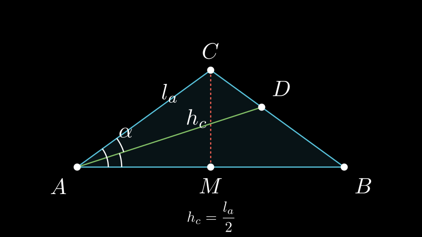

# Агли кај специфичен рамнокрак триаголник

## Текст на задачата
Одреди ги аглите кај рамнокрак триаголник $ABC$, кај кој висината спуштена кон основата е двапати помала од должината на симетралата на еден од аглите при основата.

## 📐 Скица / Конструкција

## 💡 Решение

Нека аглите при основата се $\alpha$, а аголот при врвот $\gamma$.
Висината кон основата е $h_c = a \sin \alpha$, каде $a$ е должината на кракот.
Симетралата на аголот $\alpha$ е $l_a$.
Во триаголникот $ABD$ (каде $AD$ е симетрала), аглите се $\alpha/2$, $\beta = \alpha$, и $\angle ADB = 180^\circ - 1.5\alpha$.
Според синусната теорема за $\triangle ABD$:
$$ \frac{l_a}{\sin \beta} = \frac{c}{\sin(180^\circ - 1.5\alpha)} $$
$$ \frac{l_a}{\sin \alpha} = \frac{c}{\sin(1.5\alpha)} \implies l_a = \frac{c \sin \alpha}{\sin(1.5\alpha)} $$
Исто така, во правоаголниот триаголник $AMC$ (каде $M$ е средина на $AB$), имаме:
$$ \tan \alpha = \frac{h_c}{c/2} \implies h_c = \frac{c}{2} \tan \alpha $$
Дадено е дека $h_c = \frac{l_a}{2}$. Заменуваме:
$$ \frac{c}{2} \tan \alpha = \frac{1}{2} \frac{c \sin \alpha}{\sin(1.5\alpha)} $$
$$ \tan \alpha = \frac{\sin \alpha}{\sin(1.5\alpha)} $$
$$ \frac{\sin \alpha}{\cos \alpha} = \frac{\sin \alpha}{\sin(1.5\alpha)} $$
Бидејќи $\alpha$ е агол во триаголник, $\sin \alpha \neq 0$, па можеме да скратиме:
$$ \frac{1}{\cos \alpha} = \frac{1}{\sin(1.5\alpha)} \implies \cos \alpha = \sin(1.5\alpha) $$
Користиме идентитет $\cos \alpha = \sin(90^\circ - \alpha)$:
$$ \sin(90^\circ - \alpha) = \sin(1.5\alpha) $$
Решенијата се:
1. $90^\circ - \alpha = 1.5\alpha \implies 2.5\alpha = 90^\circ \implies \alpha = 36^\circ$.
2. $90^\circ - \alpha = 180^\circ - 1.5\alpha \implies 0.5\alpha = 90^\circ \implies \alpha = 180^\circ$ (невозможно).

Значи, аглите при основата се $\alpha = 36^\circ$.
Аголот при врвот е $\gamma = 180^\circ - 2\alpha = 180^\circ - 72^\circ = 108^\circ$.
Аглите на триаголникот се $36^\circ, 36^\circ, 108^\circ$. 
5. $2\alpha + \frac{\alpha}{2} = 90^\circ \implies 5\alpha = 180^\circ \implies \alpha = 36^\circ$. 
6. Аглите се $36^\circ, 36^\circ, 108^\circ$.

## ⚠️ Аналитички пристап (само ако е неизбежен)
<Ако мора да се користат координати, објасни зошто синтетичкиот пат е претежок.>

## 🏁 Заклучок
Видете го решението погоре.