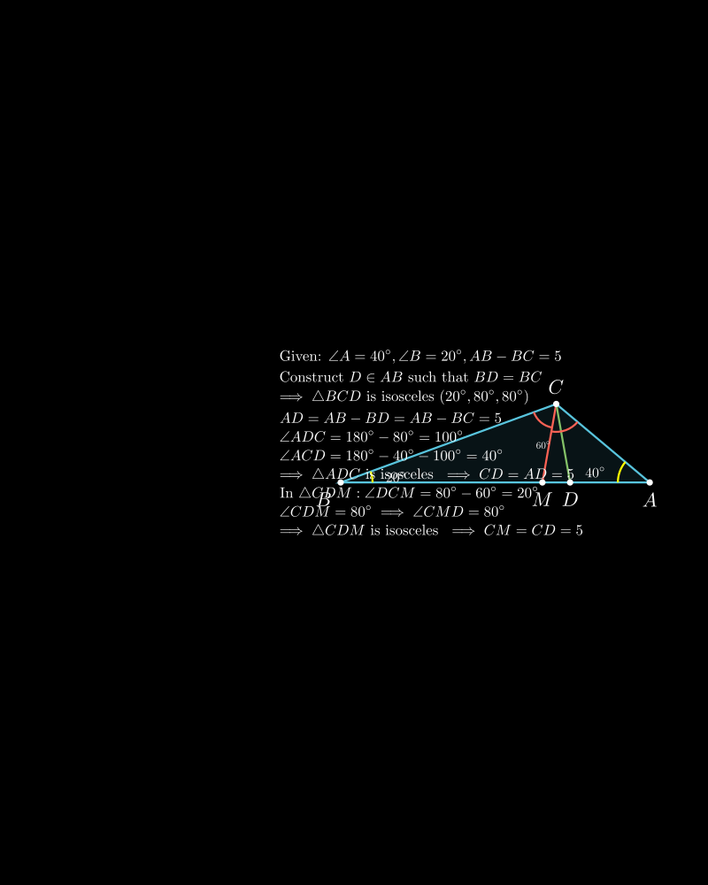
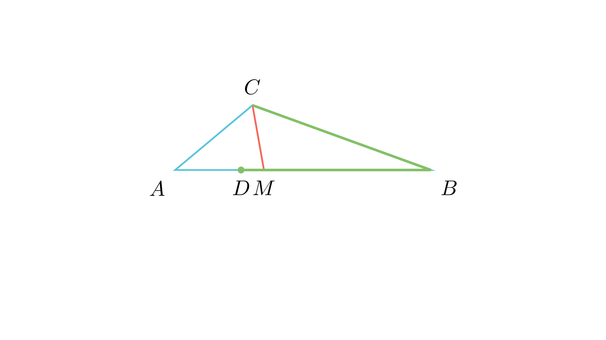

# Должина на симетрала преку разлика на страни

## Текст на задачата
Даден е триаголник $ABC$ со $\angle BAC=40^\circ, \angle ABC=20^\circ$ и $AB-BC=5$ cm. Ако симетралата на $\angle ACB$ ја сече $AB$ во точка $M$, да се пресмета должината на $CM$.

## 📐 Скица / Конструкција

{ width=500 }

## 🧠 Анализа
**Зошто е оваа задача тешка?**
Даден е условот $AB - BC = 5$. Ова сугерира конструкција на точка $D$ на $AB$ така што $BD = BC$, со што се добива $AD = AB - BD = 5$. Потоа треба да се искористат својствата на рамнокраки триаголници и пресметка на агли.

**Конструктивен потег:**
Избери точка $D$ на страната $AB$ така што $BD = BC$. Тогаш $\triangle BCD$ е рамнокрак. Пресметај ги аглите на овој триаголник и на $\triangle ADC$.

## 💡 Решение
1.  **Пресметка на аглите во $\triangle ABC$:**
    $\angle C = 180^\circ - (40^\circ + 20^\circ) = 120^\circ$.
    Бидејќи $CM$ е симетрала на $\angle C$, следува $\angle ACM = \angle BCM = 60^\circ$.

2.  **Конструкција:**
    Нека $D$ е точка на страната $AB$ така што $BD = BC$.
    Бидејќи $AB > BC$ (затоа што $\angle C > \angle A$), точката $D$ лежи меѓу $A$ и $B$.
    Од условот на задачата, $AD = AB - BD = AB - BC = 5$.

3.  **Анализа на $\triangle BCD$:**
    Бидејќи $BD = BC$, триаголникот е рамнокрак.
    Аголот при врвот е $\angle B = 20^\circ$.
    Аглите при основата се:
    $$ \angle BCD = \angle BDC = \frac{180^\circ - 20^\circ}{2} = 80^\circ $$

4.  **Анализа на $\triangle ADC$:**
    Аголот $\angle ADC$ е суплементарен на $\angle BDC$:
    $$ \angle ADC = 180^\circ - 80^\circ = 100^\circ $$
    Во $\triangle ADC$, знаеме $\angle A = 40^\circ$ и $\angle ADC = 100^\circ$.
    Третиот агол е:
    $$ \angle ACD = 180^\circ - (40^\circ + 100^\circ) = 40^\circ $$
    Бидејќи $\angle A = \angle ACD = 40^\circ$, триаголникот $\triangle ADC$ е рамнокрак со $AD = CD$.
    Значи, $CD = 5$.

5.  **Анализа на $\triangle CDM$:**
    Треба да ја најдеме положбата на $M$ во однос на $D$.
    $\angle BCM = 60^\circ$ и $\angle BCD = 80^\circ$. Значи, зракот $CM$ е внатре во аголот $\angle BCD$, што значи $M$ лежи на отсечката $BD$.
    Аголот $\angle DCM = \angle BCD - \angle BCM = 80^\circ - 60^\circ = 20^\circ$.
    Аголот $\angle CDM$ е ист со $\angle CDB = 80^\circ$ (бидејќи $M$ е на $BD$).
    Третиот агол во $\triangle CDM$ е:
    $$ \angle CMD = 180^\circ - (20^\circ + 80^\circ) = 80^\circ $$
    Бидејќи $\angle CDM = \angle CMD = 80^\circ$, триаголникот $\triangle CDM$ е рамнокрак со $CD = CM$.

6.  **Заклучок:**
    Имаме $CM = CD = 5$.

Конечниот одговор е $5$ cm.

{ width=500 }
## 🧠 Анализа
Условот $AB-BC$ сугерира конструкција на точка $D$ на $AB$ таква што $BD=BC$.

## 📝 Решение (СИНТЕТИЧКО)
1. $\angle ACB = 180 - (40+20) = 120^\circ$. Симетралата $CM$ ги дели на $60^\circ$. 
2. Доцртај $D$ на $AB$ со $BD=BC$. Тогаш $AD = AB-BC = 5$. 
3. $\triangle BCD$ е рамнокрак со агли $80, 80, 20$. Тогаш $\angle ADC = 100^\circ$. 
4. Во $\triangle ADC$, аглите се $40, 100, 40$, па $CD=AD=5$. 
5. Во $\triangle CDM$, $\angle CDM=80^\circ$ и $\angle CMD=80^\circ$, па $CM=CD=5$ cm.

## ⚠️ Аналитички пристап (само ако е неизбежен)
<Ако мора да се користат координати, објасни зошто синтетичкиот пат е претежок.>

## 🏁 Заклучок
Видете го решението погоре.