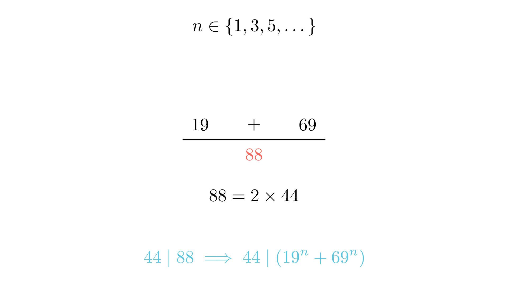

# Деливост на збирови и конгруенции

# Текст на задачата
Докажи дека бројот $19^n + 69^n$ е содржател на бројот 44 за секој непарен природен број $n$. (Забелешка: Според изворот, задачата се однесува на изразот $19 + 69$, што е специјален случај за $n=1$).

# 💡 Помош (Hints)

Кликни за мала помош

1. Размислете за вредноста на збирот на основите. Колку изнесува $19 + 69$?

$$19 + 69 = 88$$

2. Која е врската помеѓу бројот 88 и бројот 44?

$$88 = 2 \cdot 44$$

3. Присетете се на идентитетот за збир на еднакви непарни степени. Како се разложува $a^n + b^n$ кога $n$ е непарен?

$$a^n + b^n = (a + b)(a^{n-1} - a^{n-2}b + \dots + b^{n-1})$$

# Решение
## 🧠 Експертска Анализа (Интуиција)
Кога решаваме задачи за деливост на натпревари, секогаш бараме врска помеѓу основите на степените и делителот. Овде имаме 19, 69 и треба да покажеме деливост со 44. 

**Тригерот:** Првото нешто што паѓа во очи е дека $19 + 69 = 88$, а 88 е токму двократна вредност на 44. Ова не е случајност! Во теоријата на броеви, ако $a+b$ е делив со $m$, тогаш и $a^n + b^n$ е делив со $m$ за секој непарен број $n$.

Зошто ова е важно? Затоа што модуларната aritmetika ни овозможува да „гледаме низ“ големите степени. Ако работиме по модул 44, бројот 69 можеме да го напишеме како $44 + 25$, или уште подобро, како $88 - 19$. Оваа симетрија е клучот за елегантно решение.

## 📐 Детално Решение

Чекор 1: Анализа на основниот случај (n=1) — формула: 19 + 69 = 88

Да го пресметаме збирот за $n=1$, како што е наведено во изворот:

$$19 + 69 = 88$$

Бидејќи $88 = 2 \cdot 44$, очигледно е дека $88$ е содржател на $44$, односно:

$$88 \equiv 0 \pmod{44}$$

Ова го потврдува тврдењето за $n=1$.

Чекор 2: Општо решение преку идентитети

За кој било непарен природен број $n$, важи алгебарскиот идентитет:

$$a^n + b^n = (a + b)(a^{n-1} - a^{n-2}b + \dots - ab^{n-2} + b^{n-1})$$

Ако во овој идентитет замениме $a = 19$ и $b = 69$, добиваме:

$$19^n + 69^n = (19 + 69) \cdot K$$

каде $K$ е целиот број $19^{n-1} - 19^{n-2} \cdot 69 + \dots + 69^{n-1}$. Бидејќи $19 + 69 = 88$, изразот станува:

$$19^n + 69^n = 88 \cdot K$$

Бидејќи $88$ е делив со $44$ ($88 = 44 \cdot 2$), следува дека и $88 \cdot K$ е делив со $44$.

Чекор 3: Алтернативен пристап преку конгруенции

Можеме да го искористиме и својството на конгруенциите. Забележуваме дека:

$$69 = 88 - 19$$

Оттука, по модул 44, имаме:

$$69 \equiv -19 \pmod{88} \implies 69 \equiv -19 \pmod{44}$$

Сега, го креваме ова на непарен степен $n$:

$$69^n \equiv (-19)^n \pmod{44}$$

Бидејќи $n$ е непарен, $(-19)^n = -(19^n)$, па имаме:

$$69^n \equiv -19^n \pmod{44}$$

Додавајќи $19^n$ на двете страни:

$$19^n + 69^n \equiv 19^n - 19^n \equiv 0 \pmod{44}$$

Ова докажува дека збирот е секогаш делив со 44.

**Краен одговор:** Тврдењето е докажано бидејќи $19+69=88$, што е содржател на 44, и според својствата на непарните степени, $a+b$ секогаш го дели $a^n+b^n$ за непарни $n$. $\boxed{Q.E.D.}$

---
### 🎨 Визуелизација

## 👨‍🏫 Менторски Белешки
1.  **Златен Совет:** Кога гледате збир на два степена, секогаш прво проверете го збирот на основите ($a+b$) и разликата на основите ($a-b$). Овие два броја се најчестите кандидати за делители.
2.  **Чести Грешки:** Учениците често забораваат дека идентитетот $a^n + b^n$ со фактор $(a+b)$ важи **само за непарни $n$**. Ако $n$ беше парен, на пример $19^2 + 69^2$, збирот немаше да биде делив со 88. Секогаш проверувајте го условот за парност!
3.  **Зошто ова е важно:** Ова е основата на модуларната аритметика која се користи во криптографијата (RSA алгоритам) и во решавањето на напредни Диофантови равенки.

### 🔗 Поврзани вештини
* **Примарна вештина:** Модуларна аритметика (Macedonian: Модуларна аритметика)
* **Потребни предзнаења:** Својства на деливост, Алгебарски идентитети (збир на степени).