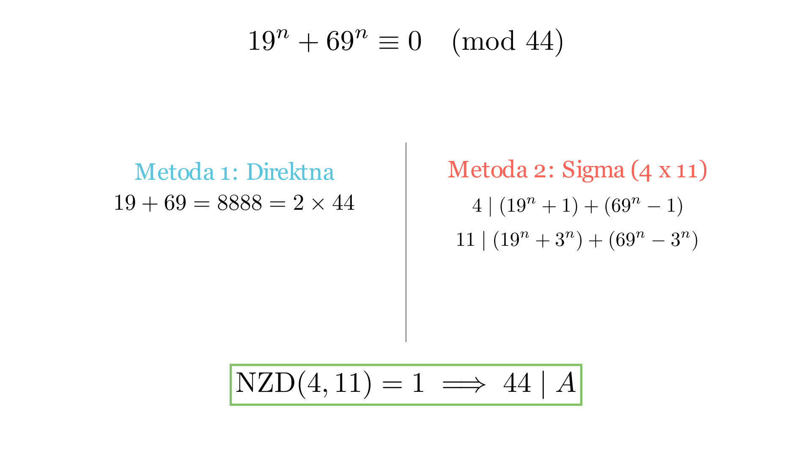

# Деливост на збирови и конгруенции

# Текст на задачата
Докажи дека бројот $A = 19^n + 69^n$ е содржател на бројот 44 за секој непарен природен број $n$.

# 💡 Помош (Hints)

Кликни за мала помош

1. Наједноставниот пат е да го разгледате збирот на основите $19+69$ и неговата врска со 44.

2. Алтернативно, бројот 44 може да се разложи на заемно прости фактори $44 = 4 \cdot 11$. Можете ли да докажете деливост со 4 и 11 одделно?

3. Користете „паметно дополнување“. На пример, за деливост со 4, запишете го $19^n + 69^n$ како $(19^n + 1) + (69^n - 1)$.

# Решение
## 🧠 Експертска Анализа (Интуиција)
Кога се соочуваме со задача за деливост на збир од степени, имаме две главни стратегии. 

**Првата стратегија (Синтетичка елеганција):** Го користиме фактот дека $a+b$ секогаш го дели $a^n + b^n$ кога $n$ е непарен. Ова е „брзиот пат“ кој го искористивме во претходната анализа. Бидејќи $19+69=88$, а 88 е содржател на 44, решението е инстантно.

**Втората стратегија (Детерминистичка анализа - од изворот Сигма):** Овој метод е посуптилен и честопати посигурен кај потешки задачи. Наместо да го бараме целиот број 44 одеднаш, го „напаѓаме“ преку неговите компоненти 4 и 11. Ова бара вештина на **паметно групирање**. Прашањето е: како да го прераспределиме изразот за да се појават множители на 4 и 11? Изворот нè учи на трикот со додавање и одземање на мали константи (како 1 или 3) за да создадеме нови парови кои се делив со нашите фактори.

## 📐 Детално Решение

Метод 1: Директна деливост преку збир на основи — формула: 19ⁿ + 69ⁿ = 88·K

За непарен природен број $n$, важи идентитетот $a^n + b^n = (a+b) \cdot K$, каде $K$ е цел број.
Заменувајќи $a=19$ и $b=69$:

$$19^n + 69^n = (19 + 69) \cdot K = 88 \cdot K$$

Бидејќи $88 = 44 \cdot 2$, следува:

$$19^n + 69^n = 44 \cdot (2K)$$

Што значи дека бројот е делив со 44 за секој непарен $n$.

Метод 2: Разложување на фактори 4 и 11 (Според Сигма 139)

За да докажеме дека $44 \mid A$, каде $A = 19^n + 69^n$, доволно е да докажеме дека $4 \mid A$ и $11 \mid A$, бидејќи $\text{NZD}(4, 11) = 1$.

**1. Доказ дека $4 \mid A$:**
Го претставуваме $A$ како:

$$A = (19^n + 1) + (69^n - 1)$$

- Бидејќи $n$ е непарен, $19^n + 1$ е делив со $19 + 1 = 20$. Бидејќи $4 \mid 20$, следува $4 \mid (19^n + 1)$.
- Изразот $69^n - 1$ е секогаш делив со $69 - 1 = 68$ (за секој природен број $n$). Бидејќи $4 \mid 68$, следува $4 \mid (69^n - 1)$.
- Збирот на два броја деливи со 4 е исто така делив со 4. Значи, $4 \mid A$.

**2. Доказ дека $11 \mid A$:**
Го претставуваме $A$ преку „поместување“ со бројот 3:

$$A = (19^n + 3^n) + (69^n - 3^n)$$

- Бидејќи $n$ е непарен, $19^n + 3^n$ е делив со $19 + 3 = 22$. Бидејќи $11 \mid 22$, следува $11 \mid (19^n + 3^n)$.
- Изразот $69^n - 3^n$ е делив со $69 - 3 = 66$. Бидејќи $11 \mid 66$, следува $11 \mid (69^n - 3^n)$.
- Збирот на два броја деливи со 11 е делив со 11. Значи, $11 \mid A$.

Бидејќи $4 \mid A$ и $11 \mid A$, заклучуваме дека $44 \mid A$.

**Краен одговор:** Тврдењето е докажано преку два алтернативни методи: директна факторзиација на $a^n+b^n$ и разложување на заемно прости фактори 4 и 11. $\boxed{Q.E.D.}$

---
### 🎨 Визуелизација

## 👨‍🏫 Менторски Белешки
1.  **Златен Совет:** Методот од изворот Сигма е исклучително моќен кога збирот на основите $a+b$ не е делив со бараниот број. Тогаш бараме број $c$ таков што $a+c$ и $b-c$ се деливи со факторите на бараниот број.
2.  **Чести Грешки:** При користење на $a^n - b^n$, деливоста со $a-b$ важи за секое $n$, но кај $a^n + b^n$, деливоста со $a+b$ важи **САМО** за непарни $n$. Секогаш потенцирајте го овој услов во вашиот доказ.
3.  **Зошто ова е важно:** Оваа техника на „разделување на делителот“ е клучна во теоријата на броеви при решавање на задачи од IMO Shortlist ниво, каде броевите се преголеми за директна пресметка.

### 🔗 Поврзани вештини
* **Примарна вештина:** Модуларна аритметика и деливост.
* **Потребни предзнаења:** Алгебарски идентитети за $a^n \pm b^n$, својства на заемно прости броеви.