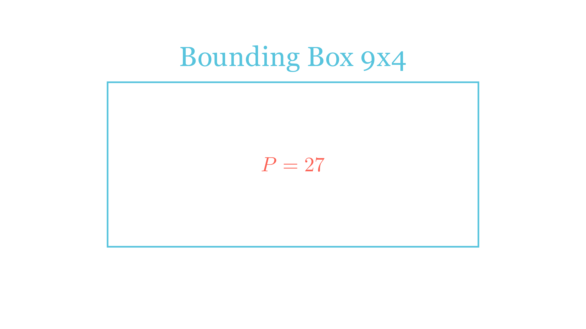

[⬅️ Назад кон Индексот](../../README.md) | [🧰 Skill: visual_reasoning](../../../tools/skill_guides/visual_reasoning.md)

# Периметар и плоштина на фигура

## 📝 Текст на задачата
Секое квадратче во мрежата има страна со должина 1 cm. Определи ги периметарот и плоштината на фигурата. (Види слика: фигура составена од правоаголници).

## 📐 Скица

  

## 🧠 Анализа
**Зошто е оваа задача тешка?**
За периметар: Замислете дека одите по работ на фигурата и собирајте ги должините. Внимавајте на „скриените“ страни. За плоштина: Поделете ја фигурата на познати форми (правоаголници) или избројте ги квадратчињата.

**Конструктивен потег:**
За периметар: Замислете дека одите по работ на фигурата и собирајте ги должините. Внимавајте на „скриените“ страни. За плоштина: Поделете ја фигурата на познати форми (правоаголници) или избројте ги квадратчињата.

## 💡 Решение

??? success "👀 Прикажи го решението"
    **Дел 1: Периметар**
    Можеме да ги собереме сите надворешни страни.
    Хоризонтални страни: $3 + 3 + 3 = 9$ cm (горе) и $9$ cm (долу).
    Вертикални страни: $1 + 3 = 4$ cm (лево) и $4$ cm (десно).
    Всушност, периметарот е ист како на правоаголник $9 \times 4$ (бидејќи вдлабнатините се „исправаат“).
    $$ L = 2 \cdot (9 + 4) = 2 \cdot 13 = 26 \text{ cm} $$
    
    **Дел 2: Плоштина**
    Фигурата може да се подели на:
    1.  Квадрат $3 \times 3$ (лево): $P_1 = 9$ cm².
    2.  Правоаголник $6 \times 3$ (десно): $P_2 = 18$ cm².
    Вкупно: $P = 9 + 18 = 27$ cm².
    
    *Алтернативно:* Броење на квадратчињата во мрежата дава 27.

## 🏁 Заклучок
Видете го решението погоре.

## 👩‍🏫 За наставници
За периметарот, методот на „извлекување на страните“ до правоаголник е многу корисен за разбирање на инваријантноста.