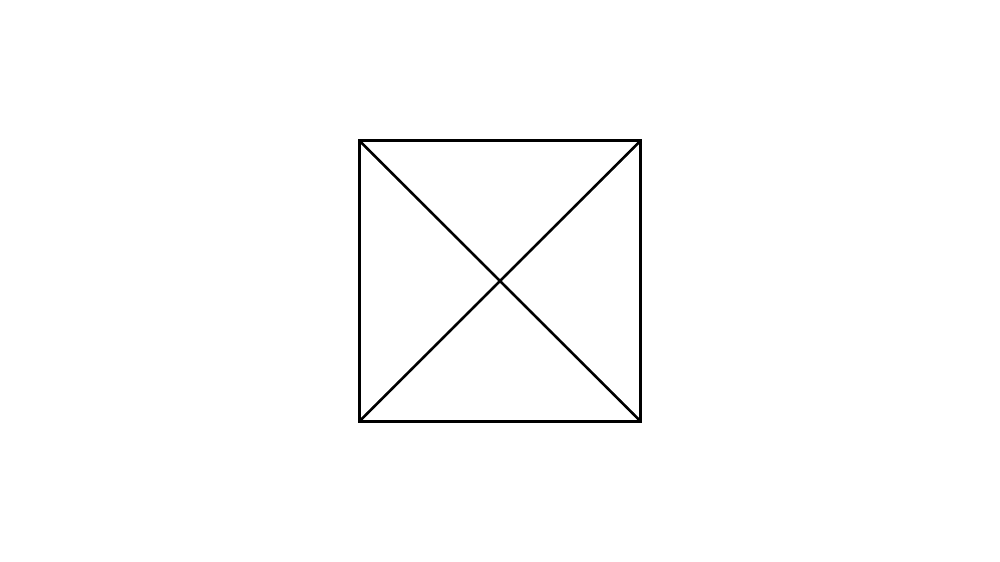

[⬅️ Назад кон Индексот](../../README.md) | [🧰 Skill: counting](../../../tools/skill_guides/counting.md)

# Броење триаголници

## 📝 Текст на задачата
Запиши ги сите триаголници што се гледаат на цртежот. (Види слика: Квадрат со дијагонали и дополнителни линии).

## 📐 Скица

  

## 🧠 Анализа
**Зошто е оваа задача тешка?**
Бројте по големина или по број на составни делови. Почнете од најмалите, па оние составени од 2 дела, итн.

**Конструктивен потег:**
Бројте по големина или по број на составни делови. Почнете од најмалите, па оние составени од 2 дела, итн.

## 💡 Решение

??? success "👀 Прикажи го решението"
    Според решението, има вкупно 10 триаголници.
    
    **1. Мали триаголници:**
    $ABD, BCD$ (Ова се половини од квадратот? Не, ова се големи).
    Ајде да ги следиме ознаките од решението:
    $\triangle ABD, \triangle BCD$ (Големи)
    $\triangle BCF, \triangle CDF$ (Средни)
    $\triangle CGF, \triangle GDF, \triangle GDE$ (Мали)
    $\triangle FGH, \triangle GDH, \triangle DEH$ (Најмали)
    
    Вкупно: 10.

## 🏁 Заклучок
Видете го решението погоре.

## 👩‍🏫 За наставници
Без слика е тешко да се визуелизира, но принципот е ист: именувај ги темињата и број систематски.